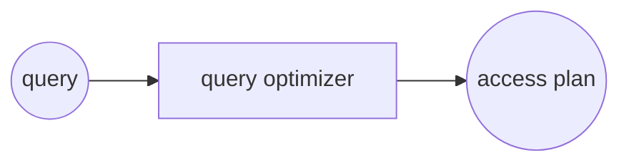
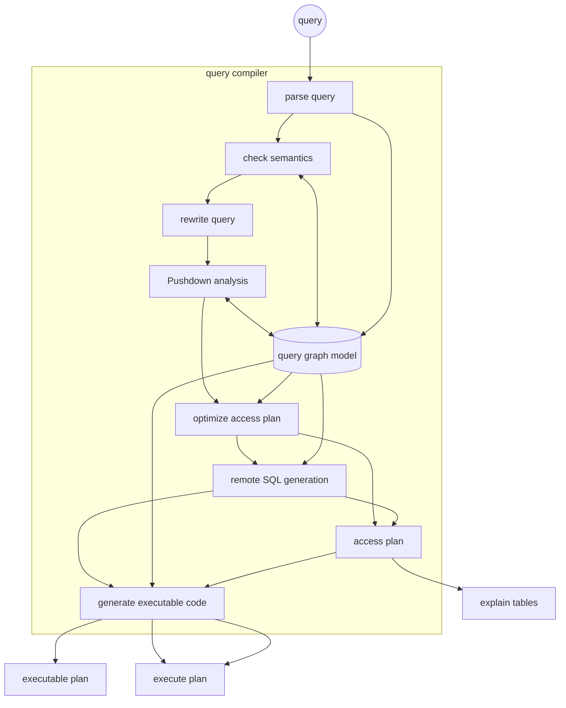

Per rispondere a una query il DBMS necessita di determinare qual'e il piano di accesso ottimale per tirare su i dati richiesti dal disco, Il componente dedito a questa mansione e il [query optimizer](/struttura_database#struttura-fisica) che data una query genera un **piano di accesso** ottimale



Il query optimizer e strutturato come segue



>[!TIP] Il funzionamento dell'ottimizzatore si basa su una **rappresentazione interna della query ad albero**

La query viene sottoposta a una sequenza di step da cui viene generata la rappresentazione interna e il conseguente piano di accesso:

## Parsing e check semantico

viene controllata la sintassi e il rispetto di vincoli sulla base dati (*query esistenti*)

l'output di questo componente e una **rappresentazione ad albero della query** simile alla forma sql con gli [Operatori logici](/operatori_relazionali#operatori-logici)  come nodi dell'albero e le relazioni come foglie


## Riscrittura della query

Successivamente la query viene riscritta in una forma equivalente sfruttando le proprietà dell'algebra relazionale

>[!WARNING] in questa fase l'ottimizzazione e **puramente semantica**! non si fanno considerazioni sui costi di accesso

Le operazioni più comuni prevedono

- risoluzione delle viste
- unnesting delle sub-query
- uso dei vincoli del db per ottimizzazione, (*rimozione di vincoli distinct su attributi chiave, ecc....*)

### riscrittura delle sub-query

Il passaggio a una forma senza sub-query alle volte è immediato

```sql
SELECT  EmpNo, PhoneNo
FROM Employee
WHERE LastName LIKE 'L%'
AND WorkDept IN (SELECT DeptNo
FROM Department
WHERE DeptName = ‘Operations’ )
```

Viene riscritta come:

```sql
SELECT E.EmpNo, E.PhoneNo
FROM Employee E, Department D
WHERE E.WorkDept = D.DeptNo
AND LastName LIKE 'L%'
AND D.DeptName = ‘Operations’
```

Rendendo quindi esplicito il join e fornendo maggior flessibilità all'ottimizzatore

## Ottimizzazione cost-based

Successivamente la query viene ottimizzata prendendo in considerazione i costi di accesso alle informazioni richieste dalla query (*vengono scelti gli opportuni operatori fisici*)

## Esecuzione del piano di accesso

Una volta determinato il piano di accesso questo deve essere eseguito per ottenere i dati da fornire in risposta, esistono due possibilita:

- **esecuzione per materializzazione** gli operatori memorizzano il loro risultato in una tabella temporanea e restituiscono all'operatore padre il risultato
>[!ERROR] estremamente inefficiente in quanto la dimensione dei risultati intermedi può portare alla necessita di salvarli nel disco
- **esecuzione in pipeline** ogni operatore fornisce un record all'operatore padre non appena disponibile
>[!WARNING] non e sempre possibile, per esempio l' operatore [sort](1762526739.md) necessita di visionare tutto l'input prima di fornire la prima tupla di output

### Implementare l'esecuzione in pipeline: interfaccia a iteratore

Per implementare l'esecuzione in pipeline gli operatori fisici sono implementati come **iteratori**  con la seguente interfaccia

```python
open():
	# inizializza, alloca buffer, passa parametri e richiama ricorsivamente open sui figli
hasNext():
	# verifica se ci sono altre tuple
next():
	# richiede la prossima tupla
reset():
	#  riparte dalla prima tupla (es. nested loops)
close():
	# termina e rilascia le risorse
```

