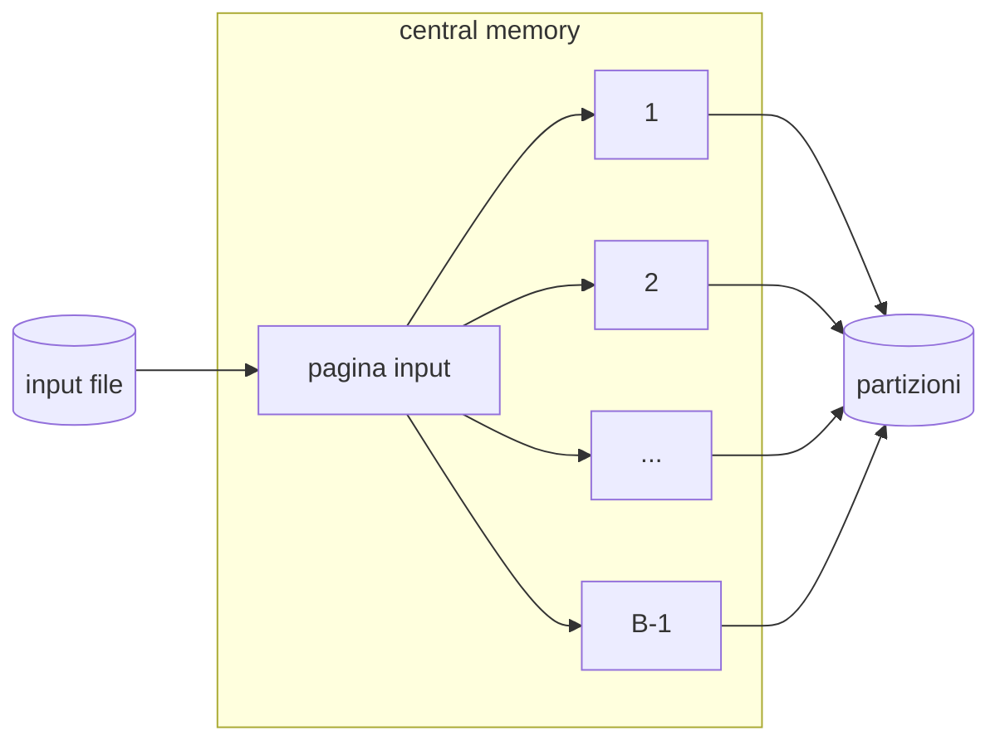

L'[operatore](1762526730.md) di proiezione consente di eliminare attributi dal risultato di una query, data una query del tipo:

```sql
SELECT DISTINCT R.sid, R.vid
FROM Recensioni R
```

E necessario eliminare gli attributi non richiesti e eliminare i record duplicati, ci sono 3 approcci principali

## Proiettare [ordinando](1762526739.md)

Una possibile soluzione e quella di sfruttare l'ordinamento, si procede come segue

- si legge il file rimuovendo gli attributi non richiesti
- si ordina per mezzo del [merge sort](1762526739.md#merge-sort-esterno)
- si eliminano i duplicati

costo complessivo dato da $P(R) +P(T) + 2P(T)\lceil \log_ZP(T)\rceil + P(T)$

>[!TIP] si possono squashare la rimozione degli attributi con la fase di sorting e l'eliminazione dei duplicati nella fase di merging del [merge sort](1762526739.md#merge-sort-esterno)

## Proiettare usando hashing

Fattibile solo se si hanno un alto numero di pagine, il processo si divide in due fasi

### Fase di partizionamento

- si leggono le pagine del buffer e si eliminano gli attributi
- si applica una funzione di hash (*a $B-1$ valori*) per suddividere le tuple in base agli attributi rimasti
- se una pagina e piena la si scrive nel disco



### Fase di eliminazione dei duplicati

si leggono in sequenza i file generati e si applica una nuova funzione hash (*diversa dalla prima* ) e si redistribuiscono i record nelle pagine e si eliminano i duplicati

>[!WARNING] l'ipotesi è che nella seconda fase **non si debbano salvare le pagine su disco**, di conseguenza il numero di pagine del file di input deve essere minore di $(B-1)^2$

>[!TIP] in caso sia necessario scrivere su disco si può ripetere il processo con una terza funzione di hash
### Sorting vs hashing

La tecnica basata su sorting risulta migliore nel caso in cui i valori risultino sbilanciati o ci siano molte tuple da eliminare
>[!TIP] con il sorting il risultato e anche ordinato :)

## Proiettare con un [indice](1762526725.md)

Questa modalità necessita che tutte le chiavi da restituire in output **siano contenuti nell'indice**, le tecniche sono le precedenti ma si attuano sull'indice e non sul file dati

>[!TIP] in caso di indice [b+tree](1762526719.md) se gli attributi sono un prefisso della chiave basta scandire le foglie eliminando i duplicati con costo $L$
