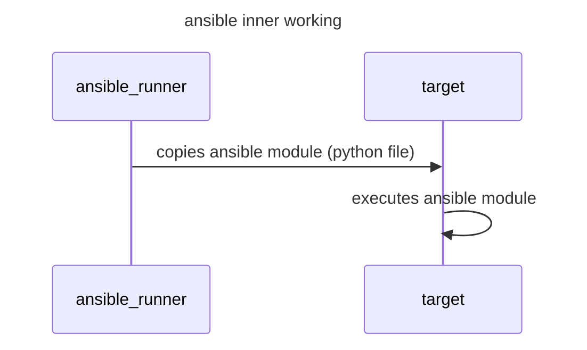

[ansible](https://docs.ansible.com/) is an network automation framework that allow to execute a series of tasks in parallel in a set of machines, it allows for both declarative and procedural approaches to define machine state and environment configurations, it's based around 2 simple concepts

- a list of a task to be executed called `playbook`
- a list of host machines to target called `inventory`

> [!NOTE]
> ansible uses ssh connection and copies python script to execute modules, so the target machine must have ssh enabled and configured and a compatible python interpreter



Ansible content can be distributed in the form of roles or collections, where a role is a set of tasks that made a specific action/configuration (*e.g. Installing docker*) and a collection is a set of roles

## Targeting hosts in inventory

Hosts in inventory can be targeted with wildcards using the following symbols `*!:`, for example to target all hosts in the subnet `192.168.17`

```yaml
- hosts: 192.168.17.*
```

To target `group1` excluding members of another `group2`

```yaml
- hosts: group1:!group2
```

## Dynamic inventories and proxmox provisioning

Ansible support different plugins to parse inventory files and generate hosts dynamically, [proxmox](/1762772374.md)

```yaml
# sample config, here secrets are loaded from an ansible vault file
plugin: community.general.proxmox
url: '{{ (lookup("ansible.builtin.unvault", "group_vars/all/vault.yml") | from_yaml).vault_proxmox_url }}'
user: '{{ (lookup("ansible.builtin.unvault", "group_vars/all/vault.yml") | from_yaml).vault_proxmox_user }}'
token_id: '{{ (lookup("ansible.builtin.unvault", "group_vars/all/vault.yml") | from_yaml).vault_proxmox_token_id }}'
token_secret: '{{ (lookup("ansible.builtin.unvault", "group_vars/all/vault.yml") | from_yaml).vault_proxmox_token_secret }}'
want_facts: true
validate_certs: false
want_proxmox_nodes_ansible_host: true
compose:
  ansible_host: proxmox_net0.ip | default(proxmox_agent_interfaces[1].ip_addresses[0]) | ansible.utils.ipaddr('address')
  ansible_port: 22
  ansible_user: "'root'"
groups:
  vms: "'qemu' in (proxmox_vm_type|list)"
  cts: "'lxc' in (proxmox_vm_type| list)"
  pwmanager: "'pwmanager' in (proxmox_tags_parsed|list)"
  dns: "'dns' in (proxmox_tags_parsed|list)"
  primary_dns: "'primary_dns' in (proxmox_tags_parsed|list)"
  secondary_dns: "'secondary_dns' in (proxmox_tags_parsed|list)"
  backup: "'backup' in (proxmox_tags_parsed|list)"
  vpn: "'vpn' in (proxmox_tags_parsed|list)"
  nfs: "'nfs' in (proxmox_tags_parsed|list)"
  docker: "'docker' in (proxmox_tags_parsed|list)"
  k3s_master: "'k3s_master' in (proxmox_tags_parsed|list)"
```

### Dividing hosts in groups

To divide hosts in group based one can use proxmox tags and parse them in the inventory

```yaml
groups:
  dns: "'dns' in (proxmox_tags_parsed|list)"
```

## Snippets

- copy script in remote host and set a cronjob

```yaml
- name: Setup cronjob
  block:

    - name: Copy cronjob script
      ansible.builtin.template:
        src: templates/cronjob.sh.j2
        dest: /usr/local/bin/cronjob.sh
        mode: '755'

    - name: Configure cron to run cronjob
      ansible.builtin.cron:
        name: "cronjob"
        minute: "*"
        hour: "*"
        job: "/usr/local/bin/cronjob.sh > /dev/null 2>&1"
```

- Block rescue for installation procedure and notifications

```yaml
- name: Do installation operations
  block:
  # tasks ....
  rescue:
    - name: Notify failed installation
      ansible.builtin.uri:
        url: "{{ ntfy_endpoint }}"
        method: POST
        body: "installation on {{ inventory_hostname }} has encounter some issues"
```

- test a variable and fail if it is undefined

```yaml
- name: Print variables and fail if absent
  block:
    - ansible.builtin.debug:
        var: foo
    - ansible.builtin.fail:
        msg: "{{ foo }} is undefined"
      when: foo is undefined
```
