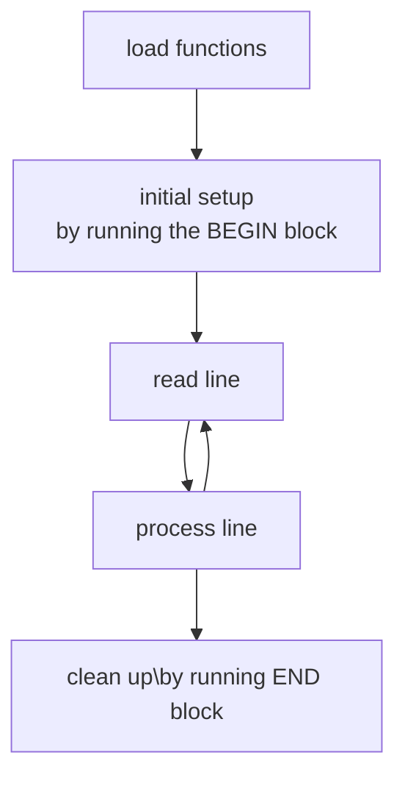

---
aliases:
  - /awk
  - /1762772359
  - /Notes/1762772359
  - /Notes/awk
book_order: 2
categories:
  - "Notes"
date: 2025-01-20
description: "awk guide and snippets"
draft: false
image: /awk.svg
layout: simple
show_image: false
show_right_column: true
show_title: true
show_toc: true
slug: 1762772359.md
tags:
  - shell
title: awk
---

`awk` is a language for text parsing and manipulation, it's often used as a tokenizer in bash pipes but it can do a lot more of that

> before starting i write down the most common use case of awk
>```bash
>some_command_that_prints_on_stdout | awk -F'[SEPARATOR]'  '{print $[FIELD]}'
>```

## Processing model

awk starts by loading user defined functions than execute `BEGIN` block that process text one record at a time (*default behavior is line filter*) :



## Syntax

Blocks are delimited by `{}` each line contains an isntruction, instructoins can be separated by `;`

```awk
BEGIN{  }
{  }
END{  }
```

## Regex filters and `~` operator

lines can be regex parsed using a variable with a regular expression and then filter the input using the `~` operator

```awk
BEGIN{
filter="REGEX"
}


$0 ~ filter{
    # operation on matched records
}
```

## Match function

match regex element and put beckrefs in an array

```awk
    match($0, /.* — (.*) ft\. .*/, arr)
    print arr[1]
```

## Oneliners

- print all token except first one

```bash
awk '{$1=""; print $0}'
```
