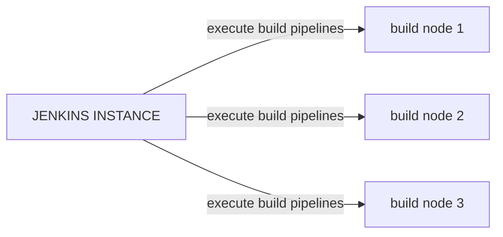

Jenkins is a CI service that can build and test software from different VCS, run automation tasks, integrate with ansible and much more, it's based around the concept of **builds**, builds are composed of a sequence of actions that  are executed on **build nodes**, build notes are enivronments that run the software build workflow



## Jenkins pipelines

Pipelines are a sequence of steps that a Jenkins system performs, they can be defined from the web UI or in an SCM system through a `Jenkinsfile`. There are 2 ways of writing a `Jenkinsfile`, through  a `declarative` syntax or a `scripted` syntax

Pipelines are made of stages that are collections of steps. A stage represents a logical group of actions that the worker has to do, for example `build` or `test`, where a step is the single action that a worker has to perform to do a certain job, for example:

```groovy
sh: make
```

This runs the `make` command

### Agent section

Is a  section where worker parameter are defined, this parameters influence the process of pipeline assignment to workers, for example:

```groovy
agent { label 'my-label1' }
```
> this one targets a worker with the `my-label1` label

possible parameters for the agent section are:

- `any`
- `none`
- `label`
- `docker`
- `dockerfile`
- `kubernetes` spawn worker as a kubernetes pod deployed on [kubernetes cluster](/1762772366.md)

## Create a Jenkins CI pipeline for github repository

One way to use Jenkins is to run build processes for github hosted software as a substitute of github actions, in this setup github will trigger with a webhook the Jenkins instance in order to run a build defined in a Jenkinsfile inside the repo, events that triggers the CI pipeline can be specified in the github repo config section

- Create a new pipeline on Jenkins and add a GitHub repository url


- Set the CI script to pull from SCM


- Create a `Jenkinsfile` with the Jenkins CI pipeline (here example for building docker images)

```groovy
pipeline {
	environment {
		registry = "carnivuth/<project_name>"
		registryCredential = 'dockerhub_id'
		dockerImage = ''
	}

	agent any
	stages {
		stage('Cloning Repository') {
			steps {
				git branch:'main',
				    url:'https://github.com/carnivuth/<project_name>'
			}
		}

		stage('Building <project_name> docker image') {
			steps {
				script {
					dockerImage = docker.build registry + ":$BUILD_NUMBER"
				}
			}
		}

		stage('Upload docker image to docker hub') {
			steps {
				script {
					docker.withRegistry('', registryCredential) {
						dockerImage.push()
					}
				}
			}
		}

		stage('Cleaning up environment') {
			steps {
				sh "docker rmi $registry:$BUILD_NUMBER"
			}
		}
	}
}
```

- Configure Jenkins to add GitHub hooks automatically to the repository
