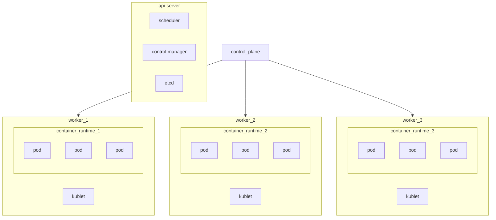
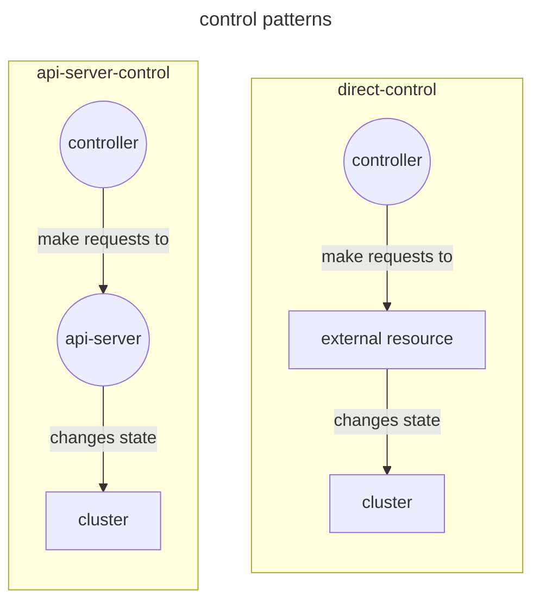

Kubernetes is a container orchestrator for managing high scale deployment challenges

## Architecture

The kubernetes cluster architecture presents itself as follows:



Where the **control plane** node manages the worker nodes that run pods, pods are managed trough a container runtime (*for example `containerd`*) that runs the containers, the control plane is  also responsible for managing deployments

## Controllers and control loops

Controllers are entities that move that runs action until a given job is concluded, moving the cluster to the desired state

### Control patterns

Controllers can make changes to the cluster in 2 modes, through the api server or directly interacting with external resources



Controllers typically monitors a set of kubernetes objects and delegate action to other elements and monitor the final state of the created objects


## Networking in a kubernetes cluster

Containers and pods share a private network stack  that allow them to communicate inside the cluster, and a name service

## Deployment in a kubernetes cluster

Deployment on a kubernetes cluster is done trough the use of the api server using a descriptor that specifies:

- containers
- images
- replicas
- volumes
- configurations

> [!NOTE]
> pods are the minimum unit of deployment in kubernetes

# Installation using `kubeadm`

To install the control plane on a linux machine do the following (*package manager updates are locked*)

```bash
sudo apt-get update
sudo apt-get install -y apt-transport-https ca-certificates curl gpg
echo 'deb [signed-by=/etc/apt/keyrings/kubernetes-apt-keyring.gpg] https://pkgs.k8s.io/core:/stable:/v1.32/deb/ /' | sudo tee /etc/apt/sources.list.d/kubernetes.list
sudo apt-get update
sudo apt-get install -y kubelet kubeadm kubectl
sudo apt-mark hold kubelet kubeadm kubectl
```

This will install necessary components on a node to run the control plane, then initialize the cluster using the `kubeadm` command

```bash
# enable forwarding
sysctl net.ipv4.ip_forward=1 && echo 'net.ipv4.ip_forward=1' >> /etc/sysctl.conf
# install containerd
apt install containerd
# init kluster
kubeadm init
```

### Configuring worker nodes

In worker nodes after installing the `kubeadm` tool, init the kubelet process

```bash
systemctl enable --now kubelet
```

Then join the kluster using `kubeadm join` command
