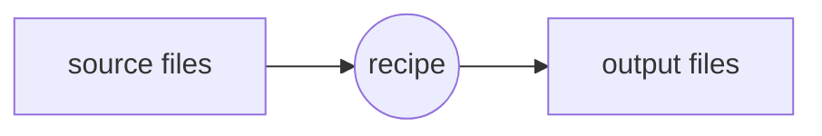

Make is a powerful build system with the simple concept of transforming files in other files based on a recipe



## Special chars

The makefile syntax involves some character that expands to specific files when make is executed, such as:

- `$%` the target member name
- `$@` expands to the target file
- `$<` expands to the first requisite
- `$^` expands to all requisites

### makefile vars

A var in a makefile is defined as follows:

```make
BUILDDIR = ./build
```

And is referred with the `$()` notations

```make
mytarget:
  some_long_command $(BUILDDIR)
```

>[!TIP] ENVIRONMENT variables are automatic exposed with the same notation `$()`, example `$(HOME)`

## PHONY targets

Phony targets are targets that doesn't generate any file, they are a useful way to group other targets together

```make
.PHONY: build clean
```

## Examples

- makefile with build directory that generates png from mermaid graph files

```make
BUILDDIR = ./build

%.png: %.mmd
	mkdir -p $(BUILDDIR)
	mmdc -i $< -o $(BUILDDIR)/$@

clean:
	rm -rf $(BUILDDIR)

build: $(patsubst %.mmd,%.png,$(wildcard *.mmd))
```
