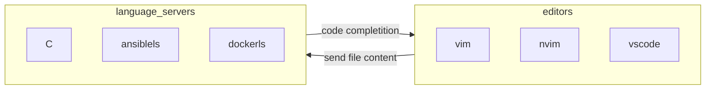

Neovim is a vim fork with builtin lsp client, support for lua scripting, and retro compatibility with the old vimscript language

## Language server protocol in neovim

It's a standard protocol  to manage interaction between code editors and process providing code completion and  syntax highlighting



Neovim provides integrated support as it feature a builtin LSP client, in my personal configuration this plugins are also enabled to improve the LSP management experience

- [mason](https://github.com/williamboman/mason.nvim) for LSP installation
- [lspconfig](https://github.com/neovim/nvim-lspconfig) for LSP configuration
- [mason-lspconfig](https://github.com/williamboman/mason-lspconfig.nvim) for automatic LSP management

## Add a language server

Language servers needs to be installed with `mason` and then activated with `lspconfig` then when the correspondent filetype is detected lspconfig will start the server and attach the client to it for the active buffer

```vimscript
:MasonInstall
:lua require("lspconfig").hyprls.setup{}
```

To check if a language server is running correctly run `:LspInfo`

```text
lspconfig: require("lspconfig.health").check()

LSP configs active in this session (globally)
- Configured servers: lua_ls, ansiblels, gopls, pyright, bashls, terraformls, docker_compose_language_service, dockerls, eslint
- OK Deprecated servers: (none)

LSP configs active in this buffer (bufnr: 1)
- Language client log: ~/.local/state/nvim/lsp.log
- Detected filetype: yaml
- 0 client(s) attached to this buffer

Docs for active configs:
```

## Setting filetype

In order to limit a language server to a specific set of files (*e.g. `ansiblels`*) configure lspconfig to run the LSP server on a specific filetype (`ansible`) and configure neovim to set the filetype for the specific set of file

```lua
-- in nvim filetypes configuration
vim.filetype.add({pattern = { [".*/playbooks/.*%.yml"] = "ansible" },})
vim.filetype.add({pattern = { [".*/playbooks/.*%.yaml"] = "ansible" },})
vim.filetype.add({pattern = { [".*/roles/.*%.yml"] = "ansible" },})
vim.filetype.add({pattern = { [".*/roles/.*%.yaml"] = "ansible" },})

-- in the lspconfig file
-------------------------------------
require('lspconfig').ansiblels.setup{
	filetypes ={"ansible"};
}
------------------------------------
```

The `pattern` objects requires a [lua pattern](https://www.lua.org/manual/5.1/manual.html#5.4.1) as argument

## Macros

Macros are a vim feature that allow to record and replay a commands, useful when making a single set of operations on a lot of lines or in multiple files with the same structure

To register a macro press `q` followed by the register where the macro will be stored for example `e`, then press the commands you want to record and then `q` again to stop registering

#### Macro visualize

To visualize a macro use the `:reg` command (*macros are stored in vim registers*)

```vim
:reg " shows content of all registers
:reg e " shows content of the `e` register
```

#### Macro replay

To replay a macro use `@` in normal mode followed by the register name, for example `@e`, number of times can also be specified, for example `5@e`, to replay a macro on all lines:

```vim
:%:normal @e
```

It will run the commands in the `e` register from `normal` mode on the all buffer `%`

## Quick command reference

- To add argument to the command line inside vim (*e.g. to add file and also buffers*)

```vim
" path expansion is allowed
:argadd [path/to/file/]
```

- To run a specific command in all open buffers

```vim
" run find and replace
bufdo %s/\](assets\/pages\/\(.*\/Pasted.*\))/](assets\/\1)/gc | update |bw

" indent
bufdo execute "normal! ggvG=l" | update |bw
```

- replace visually highlighted text without overwrite content inside default register

```vim
v
"  highlight text
yv
"  highlight text to overwrite
P
```

- To filter content in a file based on a grep expression:

```vim
:%!grep baas
```

## Implement New functions

To Extend neovim functionality new lua function can be added as commands to run from command mode with the following function

```lua
  vim.api.nvim_create_user_command('Hugo', function(opts) run_hugo_command(opts.fargs) end, { nargs = '*', complete = hugo_complete_arglead, })
```

The function accepts a lambda that implements the command logic

### Write content in the buffer

To write content into the buffer use the `vim.api.nvim_buf_set_text()` function (*see `:help nvim_buf_set_text` for details*) for example:

```lua
local row, col = unpack(vim.api.nvim_win_get_cursor(0))
vim.api.nvim_buf_set_text(0, row - 1, col, row - 1, col, { "new op line!" })
```
