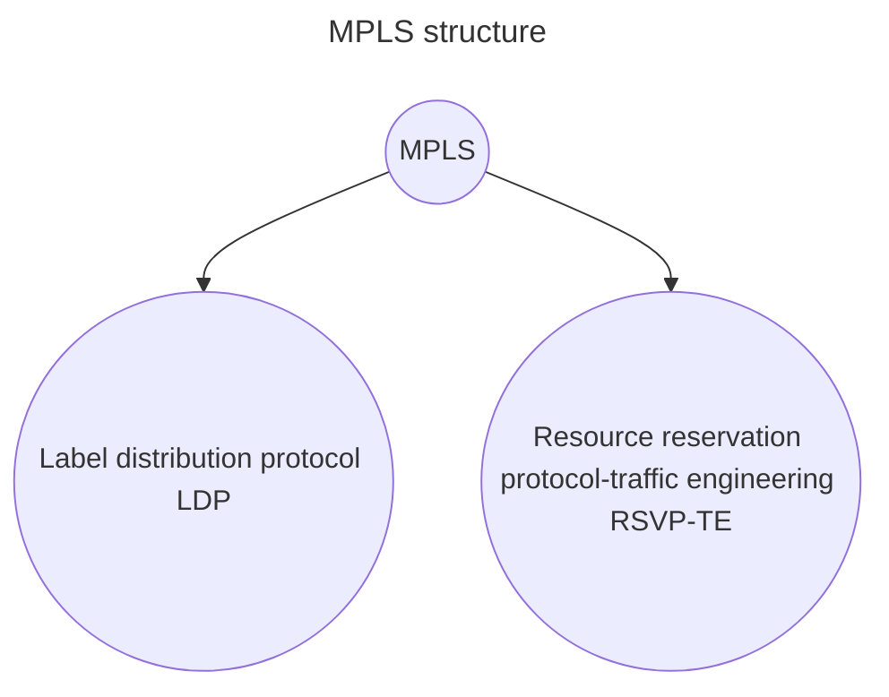

# SR routing protocol

SR routing is a routing protocol designed for cloud networks that uses logical information inside the packet to route it to destination

Is based on the [IGP protocol](https://en.wikipedia.org/wiki/Interior_gateway_protocol) to exchange routing information between forwarding nodes

## Why?

To address some issues of [MPLS protocol](https://en.wikipedia.org/wiki/Multiprotocol_Label_Switching)

### MPLS protocol

Routes traffic based on labels instead of ip addresses

> [!NOTE]
> `LDP` does not compute paths on its own and uses ` IGP` path computation results to distribute Label forwarding paths

> [!WARNING]
> `MPLS` is a statefull protocol and nodes exchange status between them to avoid synchronization problems and black holes, in order to do so a lot of service traffic is generated between nodes and the traffic scale up exponentially with the number of forwarder nodes

> [!WARNING]
> `RSVP-TE` requires that for each node in the network mash, a tunnel to each of the other nodes must be configured, so that the number of tunnels scale up exponentially with the number of nodes (*at least in Huawei implementation*) $$N_{tunnels}(network)=N*(N-1) \space with \space N \space as \space number \space of \space Nodes$$

> [!TIP]
> `RSVP-TE` requires that for each node in the network mash, a tunnel to each of the other nodes must be configured, so that the number of tunnels scale up exponentially with the number of nodes (*at least in Huawei implementation*) $$N_{tunnels}(network)=N*(N-1) \space with \space N \space as \space number \space of \space Nodes$$

> [!ERROR]
> `RSVP-TE` requires that for each node in the network mash, a tunnel to each of the other nodes must be configured, so that the number of tunnels scale up exponentially with the number of nodes (*at least in Huawei implementation*) $$N_{tunnels}(network)=N*(N-1) \space with \space N \space as \space number \space of \space Nodes$$

## SID types

- **node SID**: identify a specific node
- **path SID**: identifies a specific path between nodes
- **network SID**: identifies a specific network
