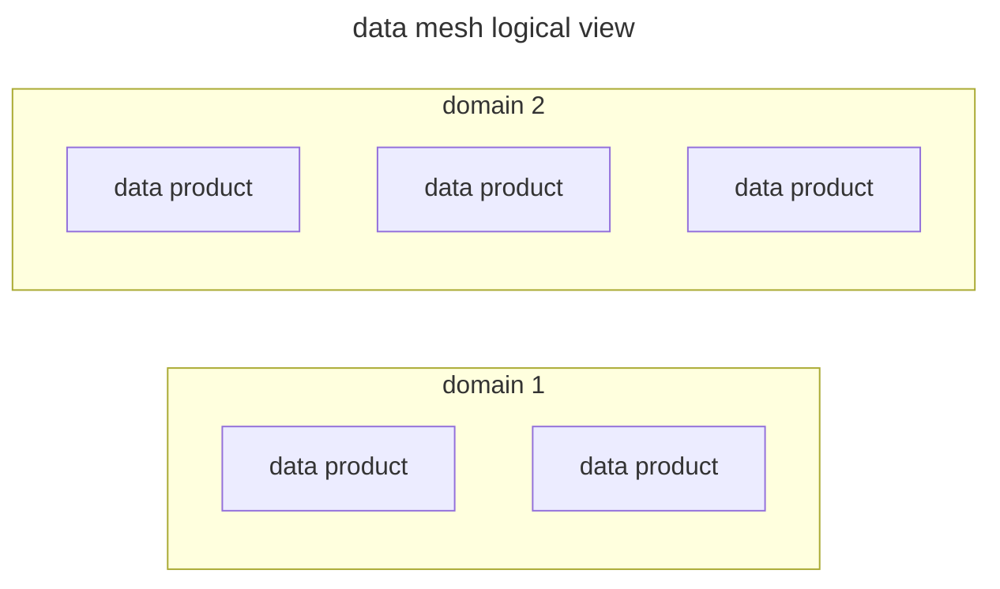
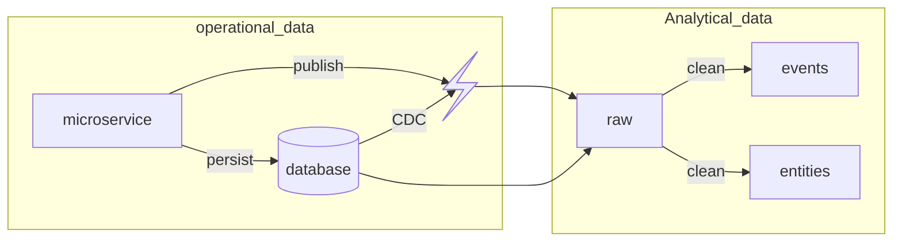

A data mesh is a practice born in industry to manage data across different domains with a focus on scalability of the data management infrastructure and a logical division based on data domains

## Data product

A data product is the minor component of a data mesh it's composed by:

- code to manage, serve and collect data
- data itself
- infrastructure to build and deploy data products

Formally:

> [!CITE]
> an independently deployable, high-cohesive component encompassing all the structural elements required for its function (architectural quantum)

## Data mesh Component relations

The mesh start to appear when components at different levels interact with component on the same level, for example data products can consume input from other data products or components at upper levels can aggregate data from different domains to correlate them

## Data product

A Data product has to accomplish this requirements:

- store domain data
- query input sources to gather data
- exposed data via output ports
- pre-process data

## Data contracts

Data exposed by a data product are formatted in datasets specified by **data contracts** that define the data format for the dataset

## Data structure

A data product storage information in a domain-driven way where data are presented trough **mutable entities** and **immutable events**

- Domain events represents a domain relevant fact
- Domain entities represents a domain relevant fact

### Data retrival

To obtain Domain events and Domain entities from the data source the pipeline is the following

The **database publish CDC events** to notify the analytical layer to pull data that are ready for the cleanup process

Events and entities are then published through the use of a [data contract](#data-contracts)

> [!NOTE]
> For analytical purposes entities history can be stored alongside the latest state of the data entities
