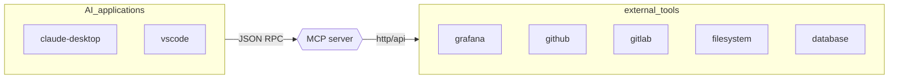

Model context protocol is a standard shipped by [antropicAI](https://www.anthropic.com/) for communication between AI capable application (*claude-desktop, VScode ecc..*) and external tools, the concept is similar to LSP where a sort of proxy component is deployed between the AI application and the external tool:

The MCP server expose an endpoint that talks [JSON-RPC](https://www.jsonrpc.org/specification) with a set of defined methods:

- `tools`
- `resources`
- `prompts`

For each of this the following submethods are defined

 - `list`
 - `get`

> [!NOTE]
> For tools and prompts `call` is also implemented

