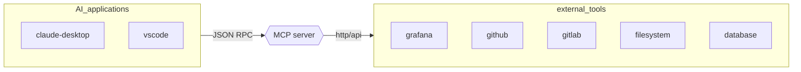

---
aliases:
  - /Model-context-protocol-(MCP)
  - /1763027940
  - /Notes/1763027940
  - /Notes/Model-context-protocol-(MCP)
book: Database Technologies and Designs
categories: ["Notes"]
date: '2025-11-13'
description: Protocol for communication between AI agent and applications
draft: false
image: https://mintcdn.com/mcp/bEUxYpZqie0DsluH/images/mcp-simple-diagram.png?w=840&fit=max&auto=format&n=bEUxYpZqie0DsluH&q=85&s=96f5e553bee1051dc882db6c832b15bc
references:
  - title: mcp architecture
    url: "https://modelcontextprotocol.io/docs/learn/architecture"
show_image: false
show_right_column: true
show_title: true
show_toc: true
slug: 1763027940.md
tags: ["mcp", "ai", "integration", "grafana"]
title: 'Model context protocol (MCP)'
---

Model context protocol is a standard shipped by [antropicAI](https://www.anthropic.com/) for communication between AI capable application (*claude-desktop, VScode ecc..*) and external tools, the concept is similar to LSP where a sort of proxy component is deployed between the AI application and the external tool:

```mermaid
flowchart LR
subgraph AI_applications
direction TB
A[claude-desktop]
B[vscode]
end
subgraph external_tools
direction TB
D[grafana]
E[github]
F[gitlab]
G[filesystem]
H[database]
end

C{{MCP server}}
AI_applications --JSON RPC--> C -- http/api --> external_tools
```

The MCP server expose an endpoint that talks [JSON-RPC](https://www.jsonrpc.org/specification) with a set of defined methods:

- `tools`
- `resources`
- `prompts`

For each of this the following submethods are defined

 - `list`
 - `get`

> [!NOTE]
> For tools and prompts `call` is also implemented

