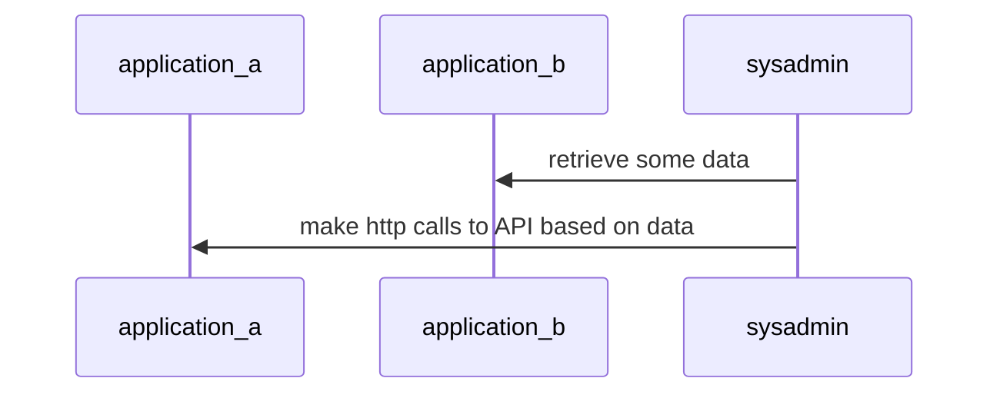

Let's start by something obvious, **ansible is an incredible power tool** when trying to achieve and maintain the same configuration on multiple environments, but at work the use case is a little weird, we use ansible to build and deploy LXC containers, i want to document what i have learned using a tool not suited for the purpose and some general best practices that i learn on the way

## Start small and keep it small

**Ansible can easily scale up** with the size of the project with almost no refactor, there is no need to start with some complex project structure with roles,dynamic inventories or secrets management from the start, a reduced project it's also easy to refactor as requirements evolve and less training time is needed when new team members need to develop or use playbooks 😊

```
.
├── readme.md
├── playbooks
│   └── do_something.yml
└── inventory.yml
```

## Reduce playbook command line parameters

Playbooks must be self explanatory and simple to use, variable must be deduced by vars file or default configurations, something like

```bash
ansible-playbook -i inventory my_very_important_playbook.yml -e "variable1=foo" -e "variable2=foo" -e "variable3=foo" ...
```

It's almost unusable, the user needs to now all the possible parameter combination side effects and plan before execution, it's also hard to test and ensure code quality before real usage on production systems

## Split operations based on atomic workflows

A playbook should be simple and workflow atomic which means that if a workflow requires some complex interactions with different machines the playbook should perform all of them in a single try, for example given the following workflow



A playbook should perform all of the operations in a single try reducing overhead in testing phase and development

## Use ansible for automation, not logic management

When i started using ansible to manage logic operations i quickly realized that it would be a pain to maintain the codebase cause playbooks starts to grow exponentially with operations for example if i want to write down application update procedure some common steps could be:

- stop application daemons
- update application components
- run migrations
- run weird application maintenance operations (clear log, clear database content based on application domain model ecc...)
- restart daemons

This steps could translate into a enormous number of tasks, checks, if then else blocks that becomes unmanageable quickly, and it's not possible to perform operations without ansible if some nodes cannot be reached by the ansible tower machine

## Conclusions

After a year of working with ansible i still have a lot to learn about the logic and problems behind provisioning and application management, new ideas and inputs for optimizing workflows development and management of playbooks comes to my mind daily and this post comes from the urgency of writing down what i have found so far to be some general guidelines to follow as my personal ansible bible 📖, link here some snippets for writing down good playbook faster
