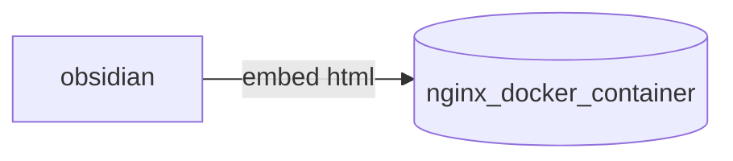

> sometimes it's just for show off

I recently started to take notes for a computer graphics course and i struggled to get `html` snippets to work, from the [obsidian documentation](https://help.obsidian.md/Editing+and+formatting/HTML+content)

> The `<script>` element normally lets you run JavaScript whenever it loads. If Obsidian didn't sanitize HTML, an attacker could convince you to paste a text containing JavaScript that extracts sensitive information from your computer and sends it back to them.

I quickly tried some plugins and configurations until i come with this strange but working (*at least locally*) solution to integrate some html snippet in obsidian

## The idea

So if obsidian does not render my html i guess i could try to embed some html sites that does it, this is the architecture that i came up with



In this architecture obsidian embeds the html content (*stored on the same vault*) that is exposed from a nginx docker container, so if i want to add the snippet `foo` to my note:

> in the obsidian note
```html
<iframe src="http://localhost:8080/foo.html"></iframe>
```

and then il start the container with docker compose:

```yaml
---
services:
  cg_snippets:
    image: nginx
    volumes:
     - ./www:/usr/share/nginx/html:ro
    ports:
     - "8080:80"
    environment:
     - NGINX_PORT=80
```
