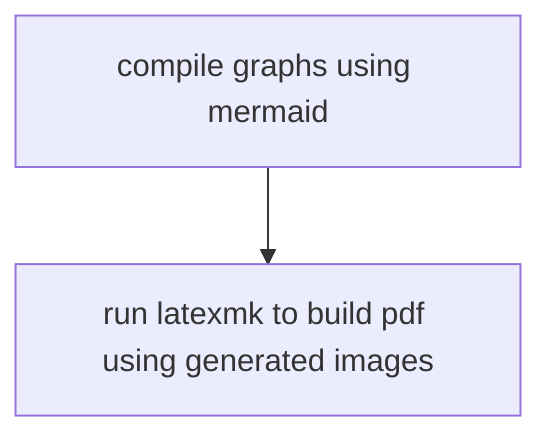
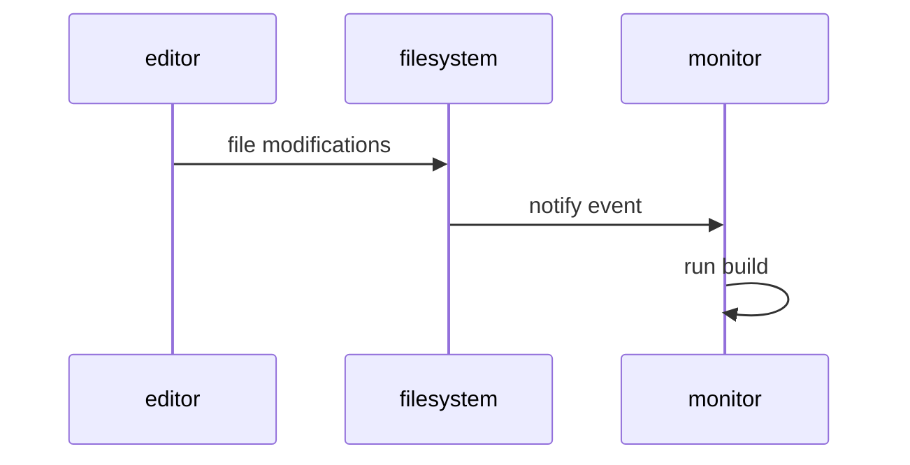

`vim` is an incredible tool when it comes to edit text and it's hard to avoid it after getting used to it, it changes the way you think about text files and editing them with it's keyboard only paradigm challenges you with ways to get faster and think of new efficient command sequences to edit text in the shell.

After some time i realized that i am not capable of editing text with *common* keybindings like `ctrl-z` or `ctrl-c/v` and my files where filled with `jjjj` and `kkkk`, also i started to evolve my workflow discovering and sometimes building tools that revolves around the terminal so that i am more comfortable, key concept: **make things faster and smarter**

## Where the problem occurs

Recently i was looking to [overleaf](https://www.overleaf.com) for making my [master degree thesis project](https://github.com/carnivuth/deployment_lifecycle_design_in_monitoring_applications), it has some cool features like live build reload, management of latex packages, live comments in the file and access from multiple devices thanks to the web interface, it has also vim keybindings 😄, there was only one problem, **graphs**.

> overleaf project workspace

Inside my thesis projects there are a pletora of architectures, sequence and workflow graphs and a thing that i hate to do is to draw them visually using a graphical editor, so i decided to use [mermaid](https://mermaid.js.org) to write them using a descriptive language, it looks all good and dandy but the workflow was a extremely tedious and slow, every time i wanted to make a change in a graph i had to:

- edit the mermaid file locally
- generate the image
- upload the new generated image to overleaf

That was a pain to manage, also graph sources and latex sources where stored separately which lead to a mess cause synchronization of the generated images and the overleaf project was done by hand, so i decided to take the bull by the horns and recreate a local environment where i can edit latex files as smoothly as in overleaf (*almost* 😅)

## Recreating overleaf but locally

So the first thing to address was the compilation of latex files cause without it the project was doomed from the beginning so i started to look the latex build system and i quickly discovered `latexmk` which i decided to wrap around a `makefile` that would build also the graphs using mermaid as a dependency

### Implementing live reload

One overleaf feature that i had to implement was the live rebuild system so i can keep editing without loosing the focus on what i am writing, my first thought was to create a polling based system that with run the build process every $X$ minutes, the problem is that it was too inefficient cause sometimes build is run but is not needed and sometimes you need to build with a much higher frequency so build is never run when you need it 😡.

The second approach was to run build on file modifications, this is a more efficient approach cause build is run only when needed, after some research i found `inotifywait` a utility that does exactly this, it demonize itself and prints on standard output the filesystem events of the monitored files, then the system runs the make target based on the modified file, this way the live rebuild system is also independent from the editor used.

> thesis project workspace

## Aftermath

The new build system worked perfectly and can be managed using git and GitHub, i also implemented a GitHub action to create releases of the thesis work using git tags. After all this side project was fun and engaging and i have learned a lot on optimizing procedures, builds and managing file system events.
