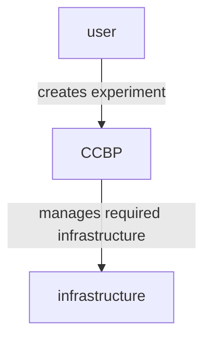

Cloud continuum blueprint (*CCBP*) is a middleware architecture to manage experiments infrastructural requirements

The CCBP tech stack is composed by the following services

-[Crossplane](/1763642327.md)
- [kubernetes](/1762772366.md)
- [keycloak](https://www.keycloak.org/)
- [couchDB](https://couchdb.apache.org/)

The architecture looks as follows:

Where:

- keycloak is used as a centralized auth management solution with OIDC for users of the CCBP,
- couchDB is used to maintain metadata about experiment entities, and kubernetes controllers monitors

When a new experiment is defined inside the CCBP a new kube namespace is created that is manage trough [crossplane](/1763642327.md) operators
