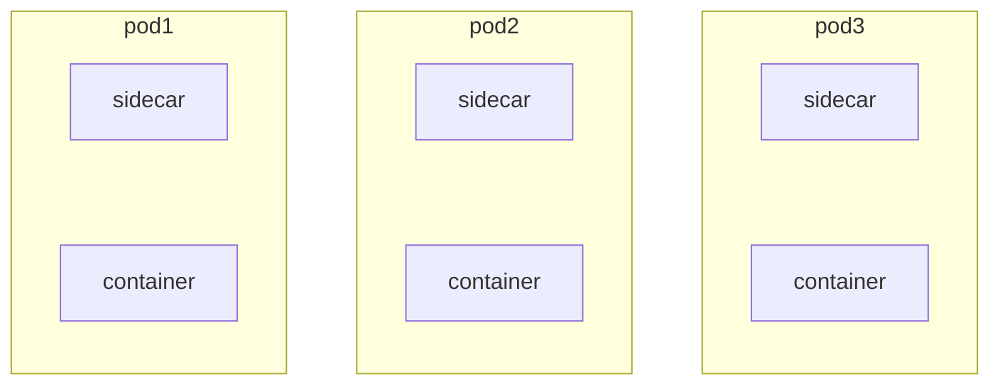
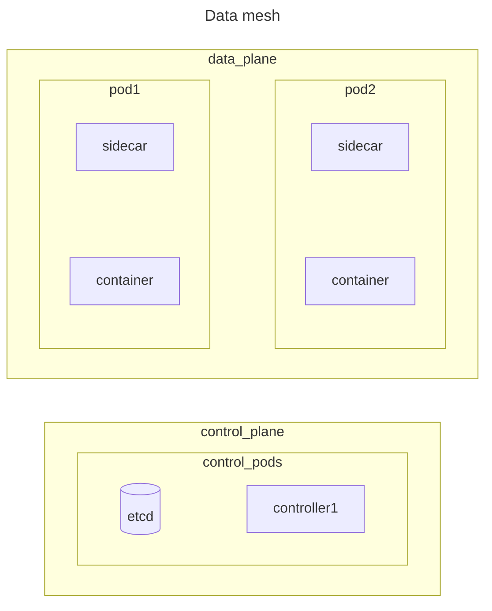
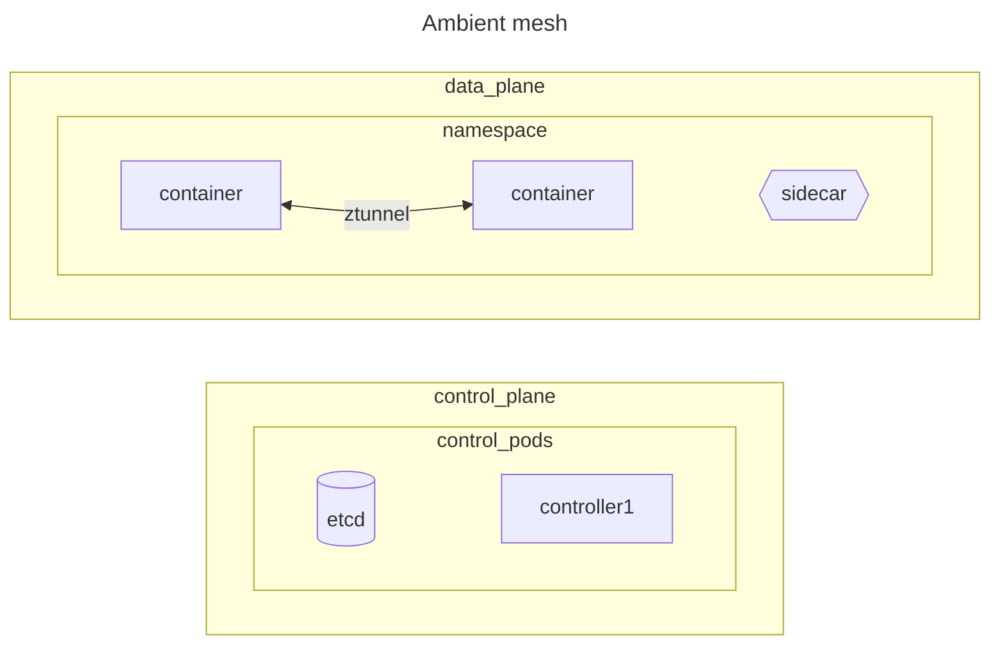

Paradigm to implement common functionalities in microservices environments, is based on the concept that each microservice is paired with a sidecar container that implements these services, the implemented ones are

- monitoring sinks
- communication east west
- security in communication east west
- reliability

> [!NOTE]
> This are common challenges in the migration from monolith application to microservices distributed systems

## What is a service mash?

Service mash is an infrastructural layer service, it's divided in 2 layer a data plane and a control plane

The control plane manages north/south communication, sidecar deployments, service discovery and records on the database

> [!WARNING]
> The service mesh has a big overhead due to the **number of containers** that duplicates because of the sidecar containers and the descriptor configuration management

##  Over service mesh limits: ambient mash

To avoid container duplication the sidecar container is moved to namespace level and communication between pods is secured using a **ztunnel** (*zero trust tunnel*)

> [!NOTE]
> this is a minor improvement but still better than nothing

## network service mash

Service mesh is an infrastructural layer that works at layer 4 and above, the network service mesh is a variant that operates at layer 2 and 3 to connect multi site clusters.
