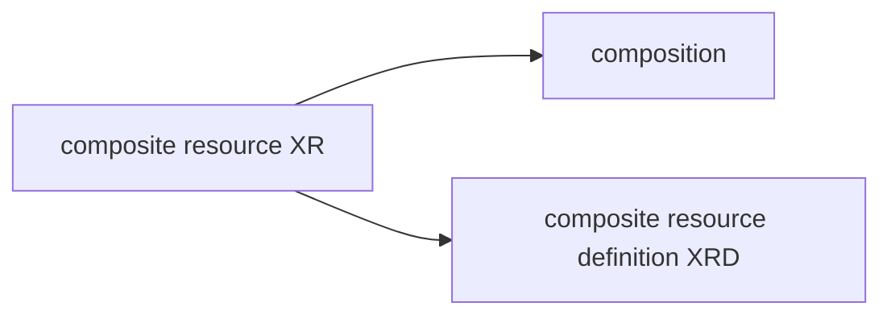

[Crossplane](https://www.crossplane.io/) is a kubernetes control plane that implements controllers for a series of external cluster resources

## Crossplane composition

Crossplane composition are aggregates that combine multiple resources in a single composition they follow a structure based on templates where a composite resource (XR) reflects the structure of a composition templates (*similar to sanet datagroup templates*)

> [!NOTE]
> Composition uses composite resource definition (XDR) to define the resource schema

