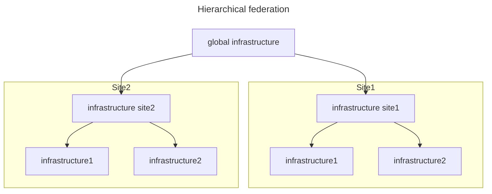
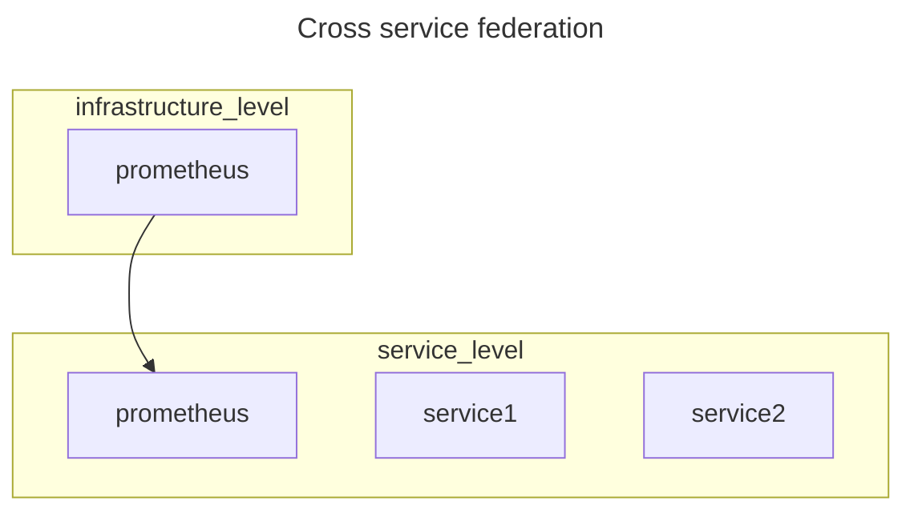

Prometheus it's a service for metrics collection, it's scrapes sources configured statically in configuration files or dynamically through service discovery systems like [kubernetes](/1762772366.md) and stores data in a time series format

The scrape operations happens using http as communication protocol and data are formatted with [open telemetry](https://opentelemetry.io/docs/) (*otel*)

## Prometheus federation

Prometheus allow to pull data from other prometheus istances using the `/federation` API endpoint, this allows prometheus to be deployed in federated environments:

Prometheus Federation can be configured in 2 ways:

- **Hierarchical Federation** prometheus servers are configured in a tree structure
- **Cross service federation** prometheus servers is configured to monitor a prometheus server of another service layer

