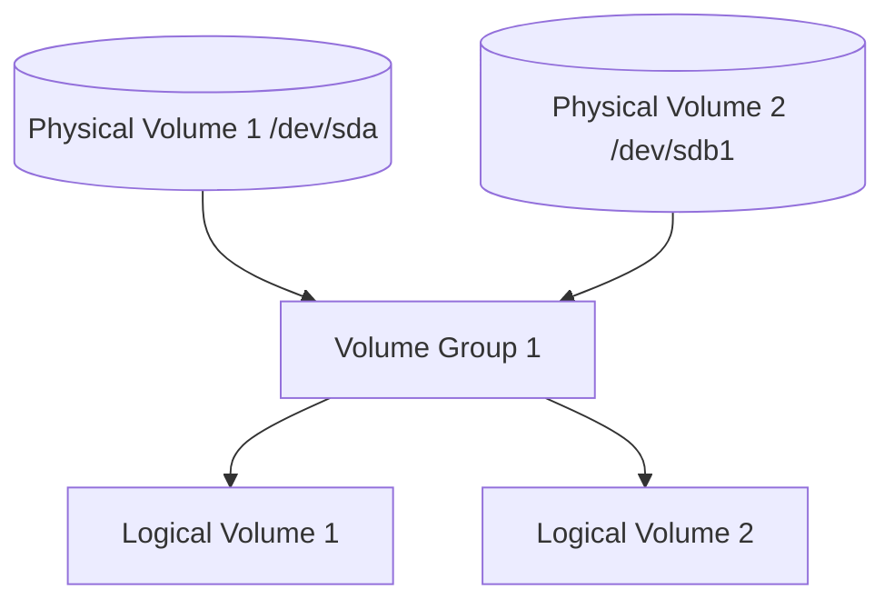

Lvm is a solution to manage multiple disks and partition under a linux system. It allows to create logical volumes that can span across multiple physical disks, and to resize them on the fly without unmounting them.

## Core concepts

LVM manages 3 entities:

- Physical Volume (PV): a physical disk or partition that is used by LVM to create logical volumes. It can be a whole disk, a partition, or even a file.
- Volume Group (VG): a pool of storage that is created from one or more physical volumes. It is the basic unit of storage in LVM, and it can be resized by adding or removing physical volumes.
- Logical Volume (LV): a virtual partition that is created from a volume group. It can



## Extend a logical volume after extending a physical volume

To extend a physical volume, run the following

```bash
pvresize /dev/sda1
```

Given a physical volume that has been extended, the logical volume can be extended like this

```bashbash
lvextend -l +100%FREE /dev/vg1/lv1
```
