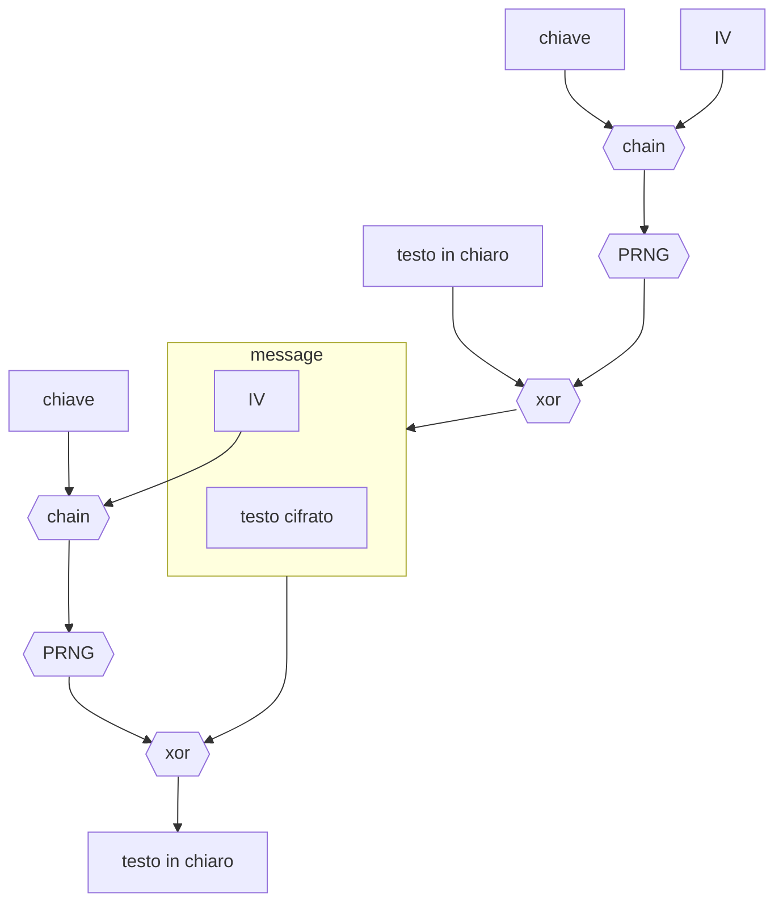

---
aliases:
  - /Protocollo-wep
  - /1773784309
  - /information-security/1773784309
  - /information-security/Protocollo-wep
book: "information security"
book_order: 5
categories:
  - "information security"
date: 2024-06-29
description: Protocollo per la cifratura di testi
draft: false
show_image: false
show_right_column: true
show_title: true
show_toc: true
slug: 1773784309.md
tags: []
title: Protocollo wep
---

Protocollo per la cifratura di testi per mezzo di [cifrari a flusso sincrono](/1773784296.md#cifrari-a-flusso)

Questo protocollo soffre del problema di [riutilizzo della chiave](/1773784296.md#riutilizzo-delle-chiavi) in quanto essa risulta essere la composizione di una parte statica e una dinamica che tuttavia si esaurisce in contesti di comunicazione molto pesanti (*e.g. molti byte da trasferire, comunicazioni wireless*)

Inoltre il cifrario utilizzato risulta **malleabile**, l'attaccante  e in grado di manipolare il testo cifrato in modo tale che in fase di decifrazione la destinazione ottenga un testo voluto dall'attaccante

