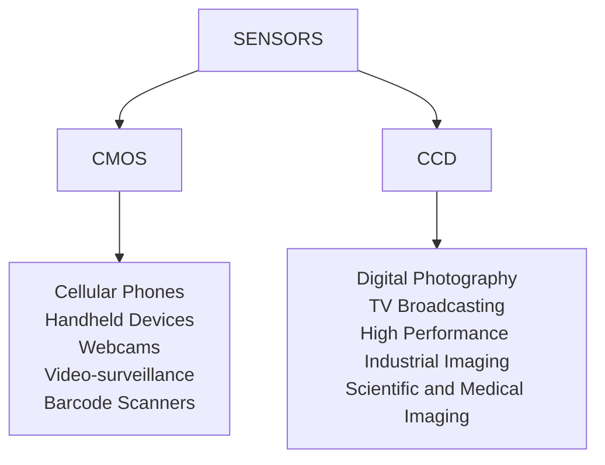

---
aliases:
  - /Sensors
  - /1774305315
  - /computer-vision/1774305315
  - /computer-vision/Sensors
book: computer vision
book_order: 4
categories:
  - computer vision
date: "2024-02-18"
description: Camera sensors
draft: true
show_image: false
show_right_column: true
show_title: true
show_toc: true
slug: 1774305315.md
tags:
 - camera
title: Sensors
---

there are 2 main technologies for camera sensors, **CCD** and **CMOS**

In short **CMOS** is for low quality mass production and **CCD** is for high end quality image processing.

