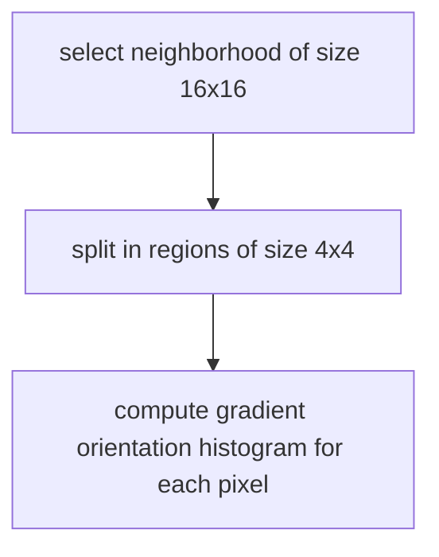

---
aliases:
  - /Sift-descriptor
  - /1774305318
  - /computer-vision/1774305318
  - /computer-vision/Sift-descriptor
book: computer vision
book_order: 38
categories:
  - computer vision
date: "2024-04-04"
description: Most used descriptor
draft: true
image: /Pasted_image_20240314124330.png
show_image: false
show_right_column: true
show_title: true
show_toc: true
slug: 1774305318.md
tags:
  - features
title: Sift descriptor
---

This descriptor is based on the gradient direction contribution of a neighborhood of the keypoint, SIFT descriptor is computed as follows

The descriptor is given by all of the histogram of the regions so the dimension space of a SIFT descriptor is $R^{128}$

The gradient are rotated according to the canonical orientation of the gradient and each pixel is weighted by a Gaussian centered at the keypoint

