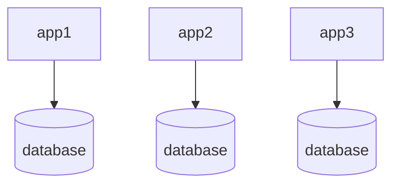
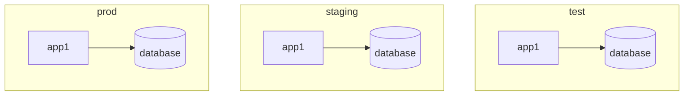

---
aliases:
  - /Kustomize
  - /1774361545
  - /Notes/1774361545
  - /Notes/Kustomize
book:
book_order:
categories:
  - notes
date: 2026-03-24
description: Combine and customize Kubernetes YAML manifests.
draft: false
image: https://kubectl.docs.kubernetes.io/images/new_kustomize_banner.jpg
references:
  - title: kustomize github page
    url: https://github.com/kubernetes-sigs/kustomize?tab=readme-ov-file#usage
  - title: kustomize kubernetes documentation
    url: https://kubernetes.io/docs/tasks/manage-kubernetes-objects/kustomization
show_image: false
show_right_column: true
show_title: true
show_toc: true
slug: 1774361545.md
tags:
  - cloud
  - container
  - IaC
title: Kustomize
---

[Kustomize](https://kustomize.io/) is a tool to combine multiple YAML files in a single [kubernetes](/1762772366.md) descriptor, it can be used to manage multiple environment definition of the same application and factorize dependencies between multiple deployments, for example given the following structure



Instead of writing the same database descriptor for the 3 application kustomize allow to define a single descriptor to import in different deployments, for example the previous structure translates like this:

```text
deployments
├── db
│   ├── deployment.yml
│   └── kustomization.yml
├── app1
│   └── kustomization.yml
├── app2
│   └── kustomization.yml
└── app3
    └── kustomization.yml
```

In a scenario where an app needs to be deployed in multiple environments, kustomize can factorize common definition like container images and leave the env vars or the volume configuration to specific overlays



```text
deployments
├── base
│   ├── deployment.yml
│   └── kustomization.yml
├── test
│   └── kustomization.yml
├── staging
│   └── kustomization.yml
└── prod
    └── kustomization.yml
```

## Internal structure

Kustomize works by reading a kustomization which is a directory with a `kustomization.yml` file inside that describe a [kubernetes](/1762772366.md) RMD, **kustomize is based on transformers**, which are plugins that can modify the generated `YAML` files, all other fields inside a kustomization file are shortcuts for a specific transformer with a default set of parameters

## Manage configMaps

To manage configMap kustomize offers a `configMapGenerator` field that can be used to generate a configMap from a file or from literal values, for example to configure a file named app.properties:

```yaml
configMapGenerator:
- name: app.properties
  options:
    labels:
      app-config: app.properties
  files:
  - configure-pod-container/configmap/app.properties
```

## Manage secrets

To manage secrets kustomize offer a similar approach with a `secretGenerator` field that can be used to generate a secret from a file or from literal values, for example to configure a file based on a `.env` file:

```yaml
secretGenerator:
- name: db-user-pass
  envs:
  - .env
```
> [!NOTE]
> this will generate secrets based on a `.env` file that can edited outside of scm
