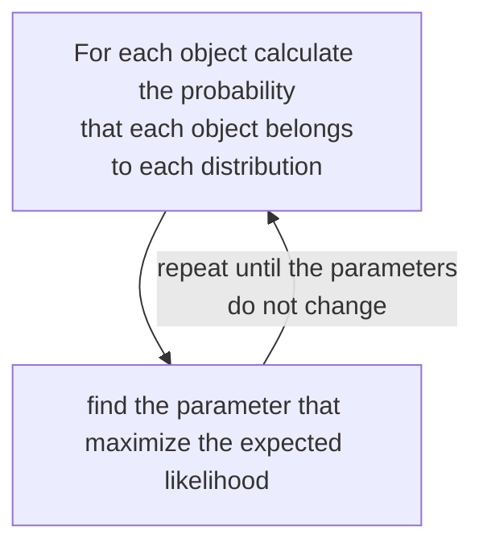

---
aliases:
  - /model-based-clustering
  - /1776547020
  - /datamining/1776547020
  - /datamining/model-based-clustering
book: datamining
book_order: 32
date: "2024-01-18"
draft: true
id: MODEL BASED CLUSTERING
image: ""
show_image: true
show_right_column: true
show_title: true
show_toc: true
slug: 1776547020.md
tags:
  - clustering
title: model based clustering
---

The objective is to estimate the parameter of a statistical model

## expectation maximization

