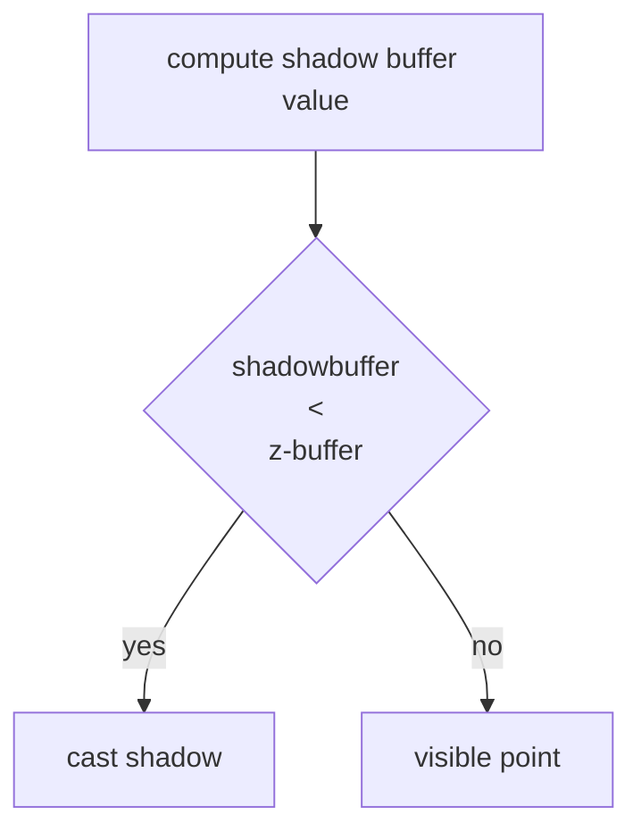


Lo shadowing e la pratica di computare le ombre dato un oggetto, una fonte luminosa e un osservatore, un punto e in ombra se la fonte luminosa non lo raggiunge ed e visibile dall'osservatore

Le ombre variano molto a seconda delle dimensioni dell'oggetto, le condizioni di illuminazione e la posizione dell'osservatore, risultano perciò molto complesse da computare

## Ombra vs penombra

L'ombra e quella che una fonte luminosa proietta nei punti non direttamente raggiungibili da essa, mentre la penombra e una zona di punti non raggiunti completamente dalla luce

>[!WARNING] Per poter avere condizioni di penombra la fonte luminosa **non deve essere puntiforme**!

>[!IMPORTANT] se la posizione relativa della fonte luminosa e dell'osservatore varia e necessario computare di nuovo tutte le ombre (*molto costoso*)

## Ombre su piani

Algoritmo che punta a disegnare data una fonte luminosa e un oggetto una geometria piana da poter colorare con il colore ombra, questo viene fatto per mezzo di una **proiezione su piano**

### Ombre su piani cartesiani

IN questo caso speciale e sufficiente trovare la coordinata $X$ sul piano del punto $P$ ottenuto come proiezione e lo si può fare con una similitudine fra triangoli:

si ha quindi che i triangoli di lati $L,V$ e $L,P$ sono paragonabili

$$
\frac{P_x- L_x}{V_x -L_x} = \frac{L_y}{L_y-V_y} \Rightarrow
$$
$$
P_x = \frac{L_yV_x -L_xV_y}{L_y-V_y}
$$

Nel caso in cui il piano non sia cartesiano e necessario proiettare i vertici del poligono sul piano arbitrario

## Ombre nello z-buffer: shadow-buffer

Per implementare le ombre nello [z-buffer](pages/computer_graphics/real_time_rendering.md#algoritmo%20z-buffer) si ricorre a un algoritmo detto **shadow-buffer**

Lo shadow buffer e un buffer in memoria che computa l'algoritmo [z-buffer](pages/computer_graphics/real_time_rendering.md#algoritmo%20z-buffer) ma dal punto di vista della sorgente luminosa

>[!WARNING] Lo shadow buffer risulta **fattibile solo per scene con singole fonti di luce** in quanto per poter computare multiple fonti si necessita di una fonte di luce per ognuna di esse

## Gestire l'aliasing

Quando si computano le ombre si hanno sempre problemi di aliasing dovuti al fatto che l'algoritmo [shadow buffer](#ombre%20nello%20z-buffer%20shadow-buffer) compie una decisione netta sul mettere in ombra o meno un pixel, in questo caso si applicano tecniche simili a quanto visto per le [textures](pages/computer_graphics/texture_mapping.md#gestire%20l'aliasing)

## Luci non puntiformi

Nella realtà le luci non sono mai puntiformi, questo porta a ombre morbide come visto in [precedenza](#ombra%20vs%20penombra) in questo caso si adottano tecniche di blur delle ombre per simulare l'effetto di una luce non puntiforme

