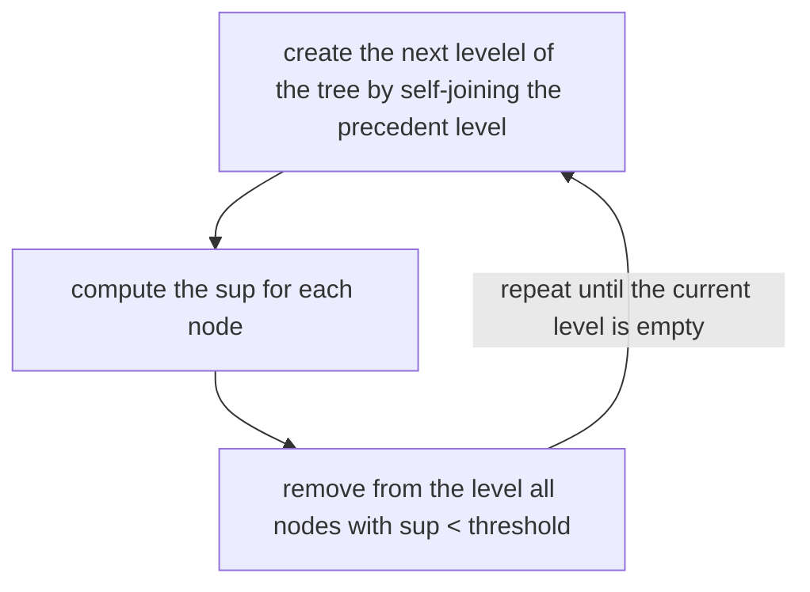

---
aliases:
  - /apriori-algorithm
  - /1776546993
  - /datamining/1776546993
  - /datamining/apriori-algorithm
book: datamining
book_order: 35
date: "2023-12-30"
description: "apriori algorithm"
draft: false
id: APRIORI_ALGORITHM
images:
  - ""
last_modified: "2026-07-15"
locale: en-US
show_image: true
show_right_column: true
show_title: true
show_toc: true
slug: 1776546993.md
tags:
  - association_rules
thumbnail: ""
title: apriori algorithm
---

- [~] ---
id: APRIORI ALGORITHM
aliases: []
tags: []
book_order: 35
---

The apriori algorithm is a strategy to prune the three of candidates of the [frequent item-set generation](/1776547016.md) fase it's based on the apriori priciple

### apriori principle
If an itemset is frequent, then all of its subsets must also be frequent and viceversa.
We can see this principle as follows:

$$
\forall X,Y: (X \subset Y) \implies sup(X) \geq sup(Y)
$$

this implies that there is no need to compute $sup$ of an itemset that contains an itemset with a $sup \lt threshold$

## the algorithm

The algorithm prunes sub-trees which have a root node with a $sup \lt threshold$

The $threshold$ value it's an important tuning parameter for complexity and the tradeoff element between number of valid time-sets founded and quality of the item-sets founded

