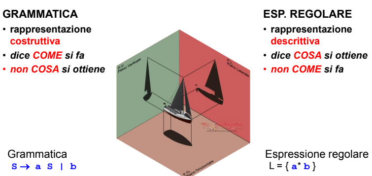


Le espressioni regolari sono un formalismo per distinguere una particolare tipologia di grammatiche dove

- la stringa vuota $\epsilon$ e un espressione regolare
- dato un alfabeto $A$ se $a\in A$ allora $a$ e un espressione regolare
- se $X$ e $Y$ sono espressioni regolari allora $X+ Y$ (*unione*), $X\bullet Y$ (*concatenazione*), $X^*$, (*chiusura*) sono anch'esse espressioni regolari

## Espressioni regolari e grammatiche

Ogni espressione regolare coincide con una corrispondente [grammatica regolare](/linguaggi_modelli_computazionali/grammatiche_regolari), rispetto a una grammatica di tipo 3, **l'espressione regolare mostra cosa si ottiene da un linguaggio** mentre la **grammatica mostra il come si ottiene**

