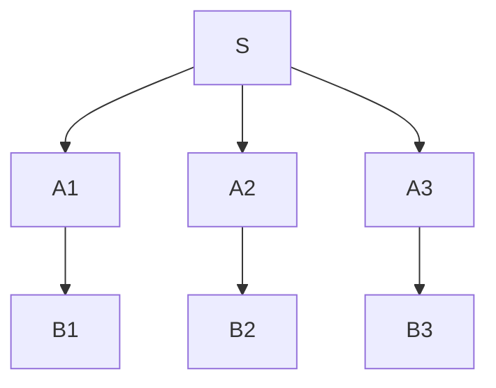


Produzioni in cui un metasimbolo può essere sostituito a prescindere dal contesto (*gli altri elementi delle forme di frase non influiscono*)

$$
A \rightarrow \alpha \space con
$$

$$
\alpha \in (VT\cup VN)*, A \in VN
$$

Inoltre in queste produzioni è ammessa la stringa vuota

## Self embedding

Le grammatiche di tipo 2 ammettono produzioni della seguente forma

$$
A \Rightarrow \alpha_1A\alpha_2
$$

Questo permette alle grammatiche di tipo 2 di generare frasi con egual numero di simboli terminali a destra e sinistra (*parentesi*)

## Conversione di grammatiche di tipo 2

Le grammatiche di tipo 2 con produzioni che ammettono la stringa vuota possono essere convertite in grammatiche in cui  non e presente il simbolo terminale, oppure e presente la forma $S \rightarrow \epsilon$, e $S$ **non compare a destra di nessuna produzione**

# Alberi di derivazione

Per le [grammatiche di tipo 2](/linguaggi_modelli_computazionali/grammatiche_tipo_2) si introduce il concetto di albero di derivazione, dato l'insieme delle produzioni $P$ si ha che :

- la radice dell'albero e lo scopo della grammatica
- dato il nodo $S$ e i suoi figli $A_1....A_N$ significa che nella grammatica e presente una regola di produzione $S \rightarrow a_1 ... a_N$ dove $a_i$ sono i simboli associati ai nodi $A_i$

Questa struttura e possibile solo per le grammatiche di tipo 2, le grammatiche di [tipo 1](/linguaggi_modelli_computazionali/grammatiche_tipo_1) e [0](/linguaggi_modelli_computazionali/grammatiche_tipo_0) ammettendo a sinistra più di un membro genererebbero un grafo e non un albero

## Derivazioni canoniche

Esistono derivazioni delle regole che formano alberi noti, la derivazione left-most che consente **nell'espansione del membro non terminale più a sinistra** e right-most che al contrario espande il membro più a destra

## Ambiguità di una frase

Una frase si dice ambigua quando ammette due derivazioni sinistre distinte

## Forme normali

Per i linguaggi generati da grammatiche di tipo 2 si possono evidenziare due forme comuni per le produzioni in cui:

- non sono presenti produzioni che fanno rename di metasimboli (e.g. $A \rightarrow B$)
- tutti i metasimboli e i simboli sono presenti nelle produzioni
- se la stringa vuota non fa parte del linguaggio non esistono produzioni che la includono

### Forma normale di Chomsky

le produzioni hanno tutte la forma $A \rightarrow BC|a$
$con \space A,B,C \in VN, \space e \space a\in VT \cup \epsilon$

### Forma normale di Greibach (per linguaggi senza $\epsilon$)

le produzioni hanno tutte la forma $A \rightarrow a\alpha$
$con \space A \in VN, \space e \space a\in VT \space e \space \alpha \in VN^*$

## Il problema della ricorsione sinistra

I linguaggi di tipo 2 possono presentare produzioni che consentono la **ricorsione sinistra**

$$
S \rightarrow S\alpha
$$

La ricorsione sinistra rappresenta un problema per quanto riguarda la riconoscibilità del linguaggio, e sempre possibile trasformare la ricorsione sinistra in ricorsione destra.

## Eliminazione della ricorsione sinistra

- Data una grammatica come segue

$$
A\rightarrow B a
$$

$$
B\rightarrow C b
$$

$$
C\rightarrow A c | p
$$

- si può applicare la sostituzione e ottenere

$$
C \rightarrow Cbac|p
$$

- a questo punto si ha che qualunque sia la sequenza di derivazione le frasi prodotte inizieranno con il simbolo $p$, quindi si può dire:

$$
\displayblock{
C \rightarrow p|pZ \\
Z \rightarrow bac|bacZ
}
$$

### Perché non eliminare sempre la ricorsione sinistra

La ricorsione sinistra può essere sempre eliminata, tuttavia l'operazione comporta un **esplicito cambiamento delle regole che generano il linguaggio**, e di conseguenza della semantica delle frasi stesse
