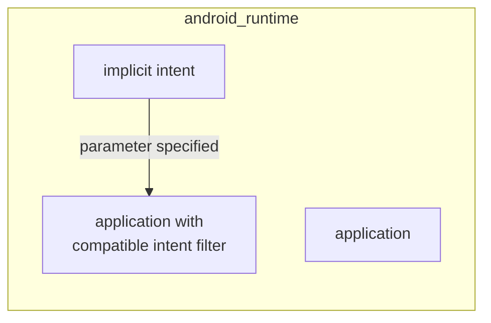

# Activity

Activities are the main component of an android application, they can interact with the user and are put into execution by the android runtime

## Activity lifecicle

Activities follow a specific lifecicle graph managed by the android runtime, where activities cycle a set of states:

- **running** when activity is visible and is interacting  with the user
- **paused** the activity is visible but is no more the active one
- **stopped** the activity is no more visible (*e.g. the user has switched to another application*)
- **destroyed** the activity is terminated and resources deallocated


In general **only one activity is in the running state where it can interact with the user**,but many activities can be processed by the runtime, when an activity is not more visible it transits in the paused/stopped state where it can recover state thanks to the **BUNDLE** object that the android runtime calls back when the activity is resumed

### Activity priorities

Activities can have different priorities that change the scheduling:


## How activities interact: tasks

The android runtime supports the interaction between activities by tasks, when an activity triggers another trough an intent, the current activity is inserted in a stack where the at the top resides the current running activities, as the activities are terminated by the user they are also removed from the activity stack


## Trigger an activity to run: intent

An activity can trigger another one by sending an intent that can be of two types:

- **explicit** the activity to trigger is  known at compile time
- **implicit** the activity to trigger is not know at compile time and the android runtime routes the intent trough the correct activities by **category**,**url**, and **mimetipe** specified in the intent by exploiting the intent filter



### Intent filter example

```xml
<activity android:name="IntentActivity">
	<intent-filter>
		<action android:name="android.intent.action.MAIN" />
		<category android:name="android.intent.category.LAUNCHER" />
		<category android:name="it.mypackage.intent.category.CAT_NAME" />
		<data android:mimeType="vnd.android.cursor.item/vnd.mytype" />
	</intent-filter>
</activity>
```

## Broadcast vs intents

Broadcast are an  alternative to implicit intents, they are sent when an event occurs, wrapped into an intent object can be of 2 types

- **system broadcast** sent by the android system when an event occurs (*e.g. wakeup*)
- **custom broadcast** sent by an application

multiple ways to send a broadcast:

- **ordered broadcast** received by one receiver at a time, receivers can abort the propagation
- **normal broadcast** received by all subscribers with no established order
- **local broadcast** received by local components of the application

### Broadcast receiver

Application component that handles the broadcast message, they register to different broadcast in 2 possible ways

- **static receivers** using manifest
- **dynamic receivers** using app or activities context
### Security aspects

it's important to limit the range of the broadcast messages to avoid leaks and enforce permissions

[<](pages/mobile_systems/android/android_platform.md)[>](pages/mobile_systems/android/threading_model.md)
