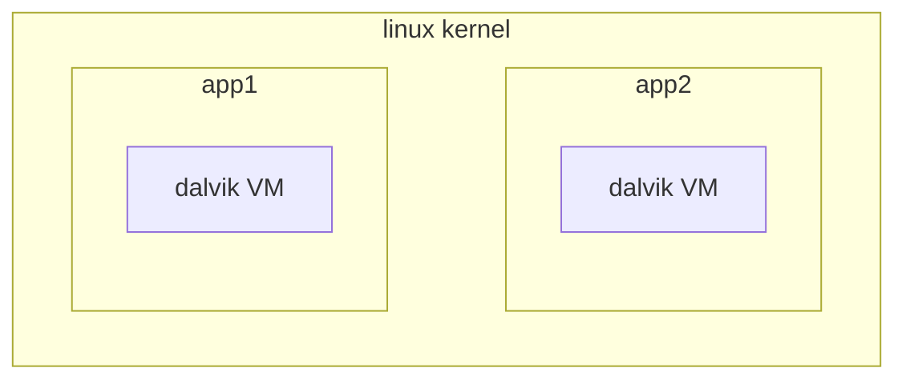

# Android threading model

Android follow a particular threadin model that can be divided in 2 levels, at the kernel level application are executed in different Dalvik VM's and the application is composed by a single java thread that runs the activities




the main thread of the application executes the following looper

```java
while(true){
	Message = m.queue.next();
	if(m!=null){
		m.target.dispatch-message(m);
		m.recycle();
	}
}
```


## Android thread groups

Android defines different group threads with different scheduling priorities

- foreground
- visible
- service
- background

[<](pages/mobile_systems/android/activity.md)[>](pages/mobile_systems/android/asynchronous_techniques.md)
