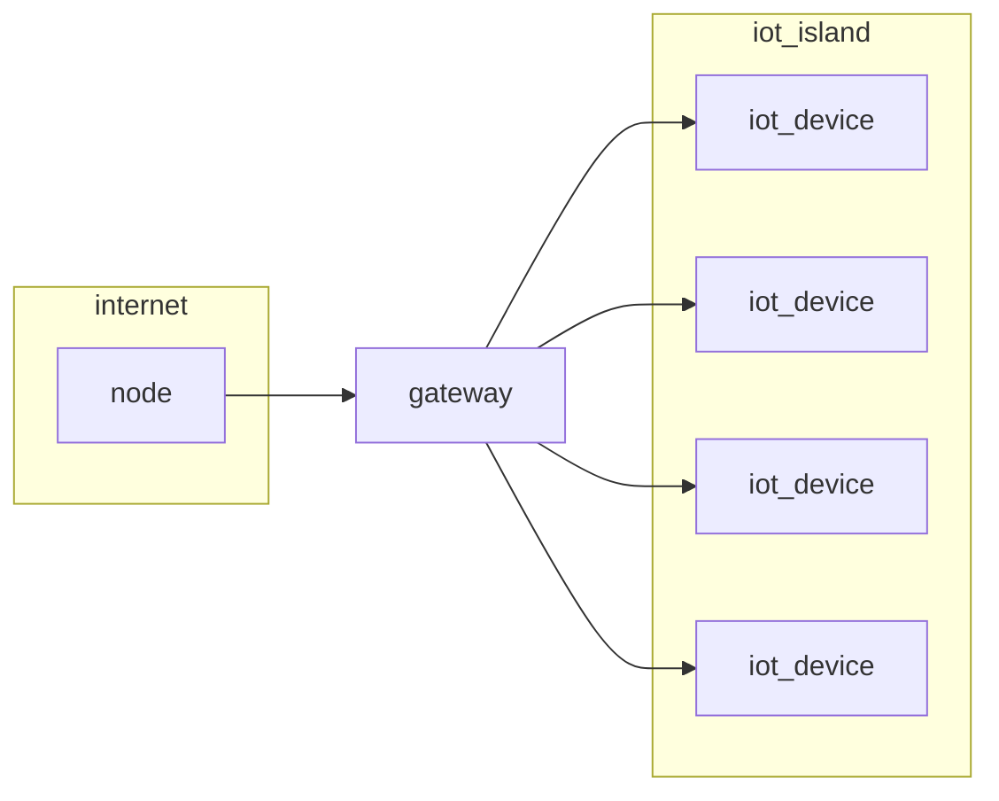

# Internet of things

IoT Systems are networks composed of different nodes with different communication capabilities that are interconnected through the internet, the IoT nodes can interact with the real world by sensing information or making physical actions (*read/write*), common infrastructure approach is this

Where a gateway mediates the traffic from the common internet and the IoT device's network that could be build with different technologies at layer 2, 3 and 4

The IoT network can have specific vertical requirements dictated by the deployment environment

## Tasks of an iot system

An IoT system tasks can be resumed as the following:

- Gather information  from things (*monitoring*) and send commands to things (*control*)
- Send information back and forth remote locations (*private/public cloud*)
- Store and aggregate information
- Analyze information to improve system knowledge
- Take decisions, in a human-assisted or autonomous manner

[<](pages/mobile_systems/android/sockets.md)[>](pages/mobile_systems/iot/scada.md)
