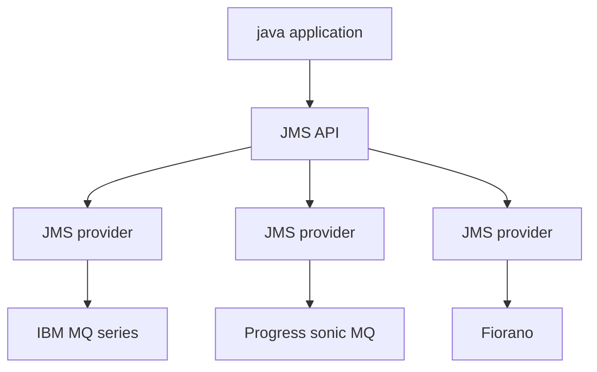
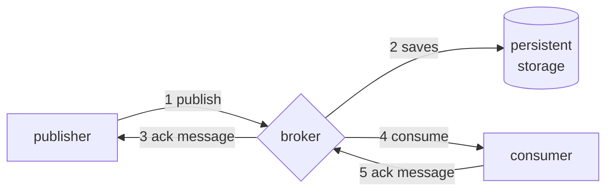

# Message management in mobile environments

One of the main principles of messages solution in mobile environment is decoupling resources involved in communication, this can be achieved by the use of standard and open formats

## Message extensibility

One important key factor is also the possibility to extend the messaging system for improved semantics, different systems can be used to achieve this

- versioning of the messages
- messaging formats with extension points
- forward compatibility with the possibility to ignore unknown parts of the protocol

## Marshalling/unmarshalling management

A messaging solution needs to take into account the marshal/unmarshal operations, possibile solutions are:

- marshal/unmarshal code can be generated from the message format specifications (*e.g. Interface Description Language (IDL)*)
- use of introspection that is more expressive but more expensive at runtime

## Data formats

Different techniques available for data format agreement:

- **Specification** usual approach of Internet protocols with messages in binary format
- **Negotiation** the two parts negotiate the data format at runtime
- **Receiver-makes-right** sender uses its native formats and specifies metadata to indicate which formats are used

## Protocol aspects

There are also protocol characteristics that need to be take into account

- session management by handling application different from the transport session
- end to end principle or not at the application level
- store and forward approach

## Communication schemes

Also the semantics with witch the communication is handled by the application component is important:

- **blocking vs non blocking semantics**  implemented with promises or callbacks
- **different level behavior**  the application can perform the role of the listener at the transport layer and not necessary the same role at the application layer

## Locators

Also locators plays a role given the fact that nodes are mobile is not always possible to use locators as IP/TCP addresses, two principle type of locator are defined:

- **transparent** locators implemented as URI ( *e.g. as in [REST](pages/mobile_systems/iot/rest.md)* )
- **opaque** need of a middleware to generate and use locators

## General considerations

Other general considerations can be made:

- **proxies** usage to split the transport connection in two
- **security**  at message level with `ssl` approaches
- **durability** in the message exchange phase even if the node is mobile
- **NAT problems** when nodes that wants to offer services are mobile

## Reliability and qos

Also QoS politics need to be taken into account, possible solution can be ACK based

- Regular
- Cumulative
- Negative
- Piggy-backed

Also in order delivery semantics can be dropped to improve performance.

## Java message service (jms)

Java solution for messaging systems, key features are:

- only-once, at-most-once semantics support
- Decoupling in time thanks to durable destinations
- Possibility of non-blocking reception via listeners
- Messages sent within a session (via a given Session object) towards the same destination benefit from in-order delivery property

### Vendor agnostic

JMS is independent from specific vendor solution and allow the application to interact with them in a transparent way



### [Reliability](#reliability-and-qos) in JMS

Reliability is handled trough ACK messages that are given from the JMS broker to the publisher and from the consumer to the broker



ACKS can be of 3 different types:

- **lazy**
- **automatic**
- **client side**

JMS allow to specify store semantics of a message:

- **PERSISTENT** messages are guaranteed that are saved at the JMS provider side
- **NON_PERSISTENT** messages are not saved on persistent storage


## [CORBA](https://www.corba.org/) messaging

Also the CORBA project offers support for messaging infrastructure, the messaging infrastructure is made of 2 principal components:

- **Asynchronous Messaging Interface (AMI)** Possibility of both polling and callback (*callback is passed as CORBA object, therefore even not in the same addressing space of client*)
- **Time Independent Invocation (TII)** to specify which CORBA objects play the role of router for the message ( *implementation of the [store and forward](#protocol-aspects) principle* )

### [LOCATORS](locators) in corba

Locators are implemented trough Interoperable Object Reference (IOR), with different profiles depending on binding protocol

### Callback vs polling

For the callback approach the application defines a callback function to be called

```c
voidsendpoll_somma (in int i, in int j)
voidpollsomma (out int success, out int somma)
```


For the Polling approach the application decides when to interrogate the CORBA support to retrieve the operation result:

```c
voidsendpoll_somma (in int i, in int j)
voidpollsomma (out int success, out int somma)
```


## Extensible messaging and presence protocol (xmpp)

Protocol develop for large scale distributed application to notify if a user is connected to the application (*online status*).It's  a [pub/sub](mobile_systems/pub_sub_model) protocol with messages codified in xml format

XMPP is based on the client server model of interaction, where client send XML encoded data flows to the server after parameter negotiation.

### Interaction semantics

The protocol manages one-to-one and one-to-many communication

- message stanza one-to-one mechanism
- presence stanza one-to-many mechanism based on pub/sub
- info/query stanza request-response mechanism

### Not specific designed for the purpose

XMPP is not designed for message exchange but given the popularity is a good candidate with some major flaws

- XML format is expensive for constrained devices
- high cost for message interaction cause connection needs to be reestablished with each interaction

To address this flows Android use a proprietary implementation to address this issues.


