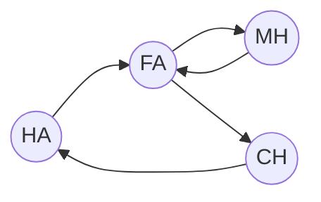
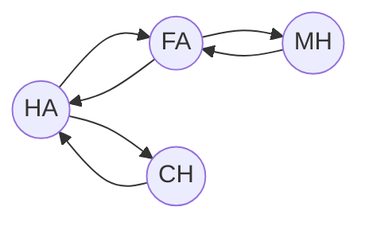

# Mobile ip

IP based protocol to handle mobility of the connections, one of the goals of mobile IP is to not modify the IP stack but works on top of that trying to be more transparent

the mobile IP relies on 3 entities

- **Mobile host (MH)** the mobile nodes moving in different networks, it register the address received from the foreign agent to the home agent (**CoA**)
- **Home agent (HA)** the agent of the home network of the mobile nodes, it has the task to forward traffic direct to the mobile node to the foreign agent where the mobile node resides
- **Foreign agent (FA)** agent of the network where the mobile node is located, it receives traffic from the home agent

The communication between the HA and FA is done trough IP in IP tunneling

In order to keep track of visitor nodes on his network the FA maintains a visitor table, The home agent maintains a table with the last **CoA** given from the mobile
## Triangular routing

This solution falls on the problem of triangular routing

## Care of address (coa)

There are 2 types of CoA:

- **Foreign agent CoA**  same ip address of the FA, it exploits level 2 routing to route packets through the correct MH
- **co-located CoA** CoA is assigned to the mobile node direclty (*e.g. through DHCP*) and can be used for traffic forwarding

## In the case of firewalls

Mobile IP suffers when in/out filters are present in the network such as perimeter firewalls cause:

- a firewall can find in-going traffic from an address that belongs to the internal network
- a firewall can find out-going traffic from an address that is not part of the internal network

one of the possible solutions is to send all traffic from the mobile node to the Home agent, this is called **quadrilateral routing**

[<](pages/mobile_systems/mobility/host_identity_protocol.md)[>](pages/mobile_systems/mobility/hierarchical_mobile_ipv6.md)
