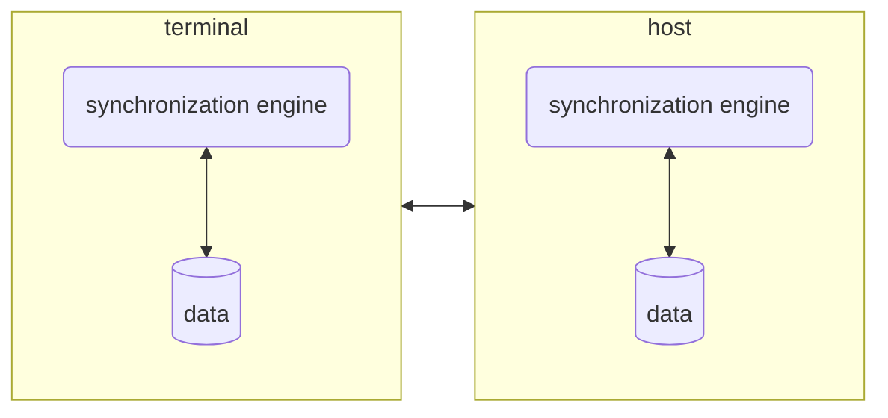
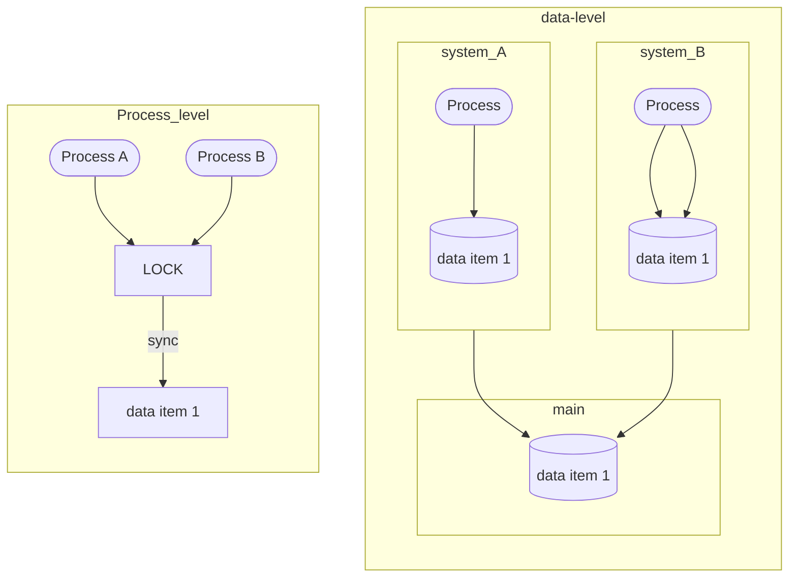
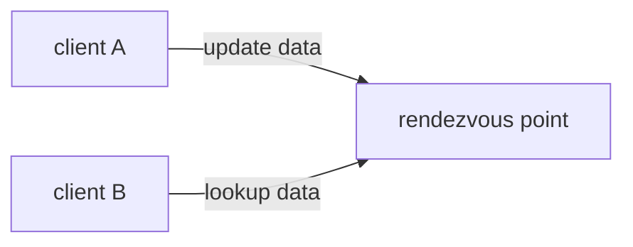

# Resource management patterns

Patterns that are developed for managing data and resources in distributed environments
## Session token

Pattern to handle session between server client communications, a token is sent to the client from the server with the following information

- session ID;
- security related data
- session state
- session TTL to avoid replay attacks

### Pros

- session is preserved if mobile node changes the point of attachment to the network
- there is no overhead for the client in order to manage session

### Cons

- server needs to manage the state of the session

## Caching

Simple concept, store acquired information from the server in order to reduce the number of communications needed to perform operation.
When client needs a resource it ask the cache and request data to the server in case of a cache miss

### Eager acquisition

All data needed by the application are fetched at startup to avoid network communication in the long run, improving performance at runtime.
This increase startup times and can download data that are not used in the specific session

### Lazy acquisition

Data are fetched when the application requires them explicitly, reducing the data transfered over the network.

## Synchronization

Pattern that allow to manage different data copies in different nodes, handling read write operations.
Application delegates the read/write operations to a synchronization engine that handle the complexity of communicate to the other nodes detect and resolve conflicts

There are 2 possible models for synchronization

- **process level** multiple process access a resource and sequential interaction is imposed
- **data level** processes works on local copies of data and synchronization operations are triggered

for data level synchronization some choices need to be made

- **when to trigger sync operations** manual versus automatic triggers
- **how to manage sync operations**
	- optimistic multiple data copies are managed by the synchronization engine
	- pessimistic approach only a single copy of the data is writable

### Synchronization mechanisms

### Versioning

Optimistic approach that relies on version numbers, that are associated to a resource, a version number is defined by the following characteristics
- if version $B$ comes from changes $A$ are $num(B) > num(A)$
- two version number coming from the same version number are incompatible and needs a merge operation

- **update propagation**;
- **changes detection**;
- **reconciliation**

### Rendezvous

Pattern that allow nodes to synchronize data by meeting at randezvous points

### What in real environments

in Real scenarios sincronization is used only between 2 nodes
- **centralized**
- **tree structure** nodes sync with the parent (*more flexible solution using a cyclic connected graph*)

## State transfer

Pattern that allows the infrastructure to manage handover situations exploiting [RENDEZVOUS](#RENDEZVOUS) to update clients

[<](pages/mobile_systems/mobile_middleware/distribution_patterns.md)[>](pages/mobile_systems/mobile_middleware/communication_patterns.md)
