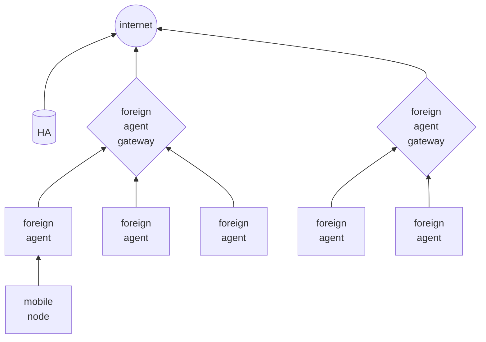

# Hierarchical mobile ipv6 (hmip)

This solution is based on a hierarchical structure of the infrastructure where foreign agents are associated with a foreign agent proxy (mobile anchor point MAP) that manages handoff procedures between foreign agents

the handoff can be

- **local subnet handoff** local to a MAP
- **MAP domain handoff** between to different MAPs

The mobile nodes organizes themselves in MAPS dynamically based on **service rate** and **mobility rate**

[<](pages/mobile_systems/mobility/mobile_ip.md)[>](pages/mobile_systems/mobility/proxy_hierarchical_mobile_ipv6.md)
