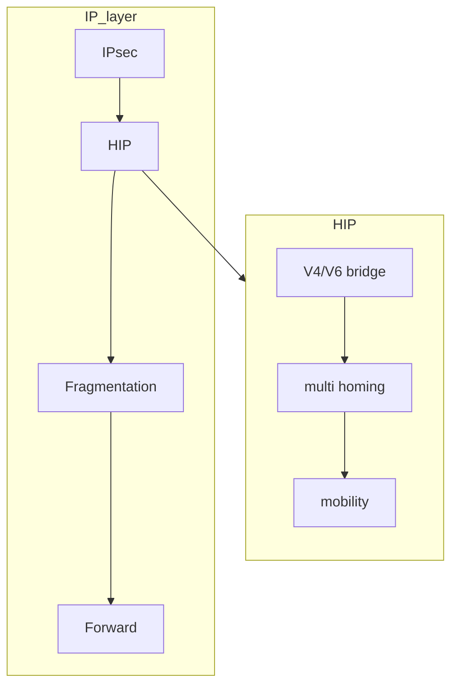

# Host identity protocol

Complete revision of the ip protocol in order to separate location and identity of a node, the protocol integrates cryptographic Host Identifiers in the ip stack, ipv4,ipv6 interoperability

[<](pages/mobile_systems/mobility/mobility_ip_networks.md)[>](pages/mobile_systems/mobility/mobile_ip.md)
