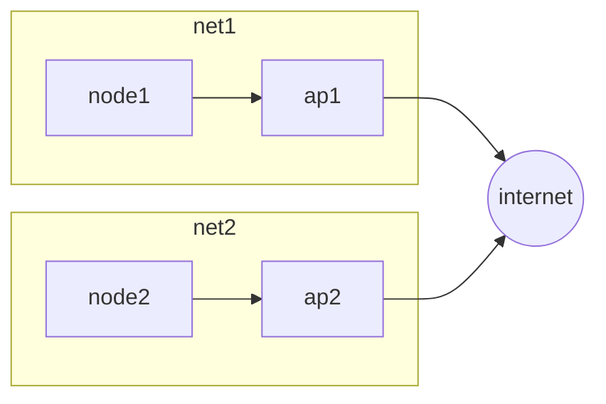
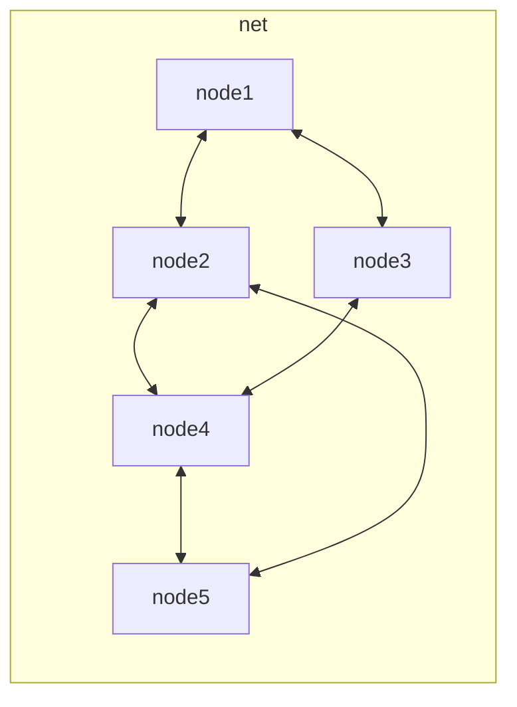
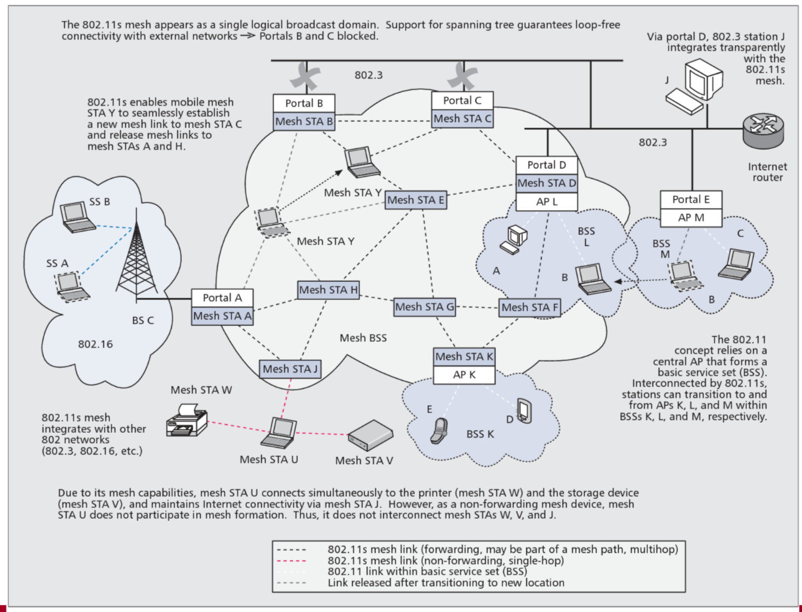

The IEEE 802.11 standard is the most widespread solution for wireless communications, it implements both the [base station mode](/mobile_systems/wireless_communication#base-station-mode) architecture and the [ad hoc mode](/mobile_systems/wireless_communication#ad-hoc-mode) architecture

## Wifi mesh network

The objective is to cover with wireless connectivity technology wide areas like cities with a mesh network

