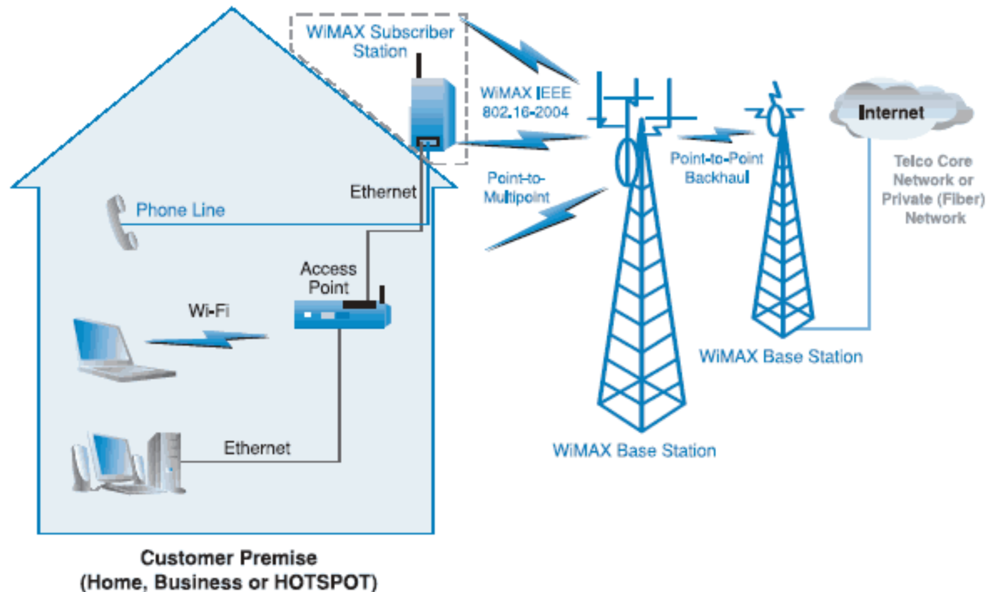

Technology solution for metropolitan area networks (*MAN*), the idea is to connect multiple antennas (*subscriber station*) to a central base station, in order to connect areas where fiber cable would be economically impossible

