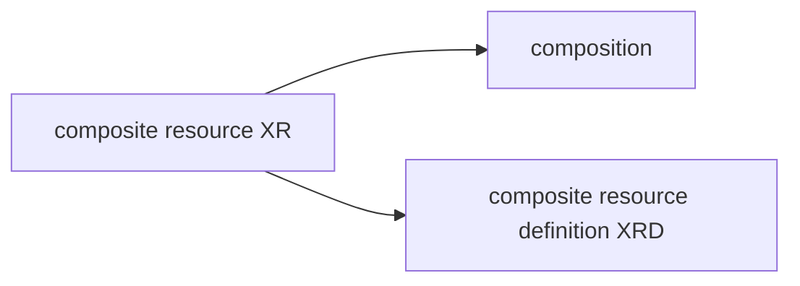

---
aliases:
  - /Crossplane
  - /1763642327
  - /notes/1763642327
  - /notes/Crossplane
book: notes
date: 2025-11-20
description: kubernetes control plane
draft: false
image: /1777219037.svg
references:
  - title: Crossplane docs
    url: https://docs.crossplane.io/
show_image: false
show_right_column: true
show_title: true
show_toc: true
slug: 1763642327.md
tags:
  - cloud
  - container
  - Ci/Cd
  - provisioning
  - IaC
  - infrastructure
thumbnail: /1777219037.svg
title: Crossplane
locale: en-US
---

[Crossplane](https://www.crossplane.io/) is a [kubernetes](/1762772366.md) control plane that implements controllers for a series of external cluster resources

## Crossplane composition

Crossplane composition are aggregates that combine multiple resources in a single composition they follow a structure based on templates where a composite resource (XR) reflects the structure of a composition templates (*similar to sanet datagroup templates*)

> [!NOTE]
> Composition uses composite resource definition (XDR) to define the resource schema
