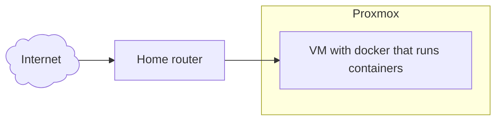
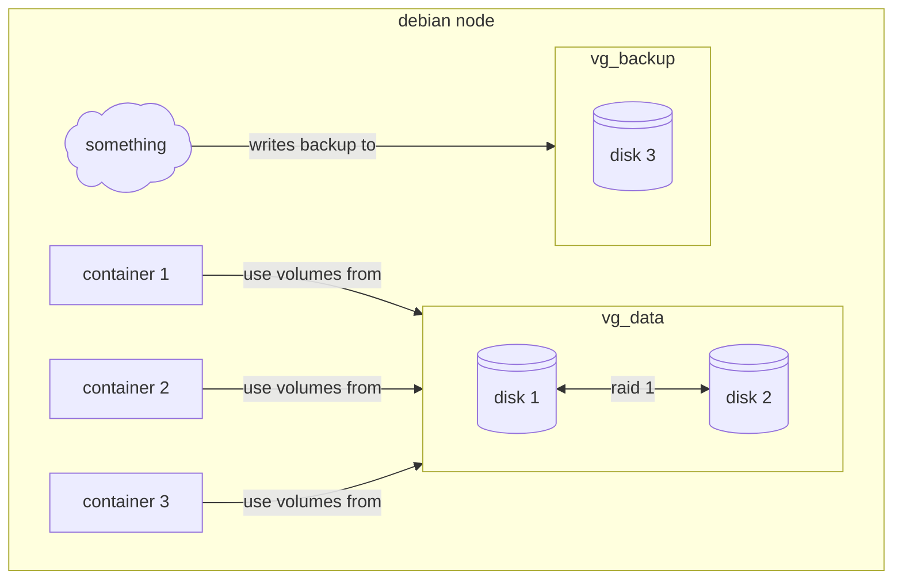

---
aliases:
  - /Escaping-From-proxmox
  - /1785504973
  - /posts/1785504973
  - /posts/Escaping-From-proxmox
book: posts
book_order:
date: 2026-07-31
description: migrating from proxmox ve to bare metal docker node
draft: true
images: []
locale: en-US
references: []
show_image: true
show_right_column: true
show_title: true
show_toc: true
slug: 1785504973.md
tags: []
title: Escaping From proxmox
last_modified: ""
---

This seems a little bit weird to write but recently i decided to migrate my personal homelab solution from [proxmox](//1762772374.md) ve to bare metal debian installation running docker containers, **WHY?** well, first because i can, it's my personal playground after all and second cause managing a pve instance has become an overhead that i don't want to tollerate further, for various reasons

## Current setup

My current setup is composed of a single node proxmox installation with a single vm that acts as a docker host that runs all of my personal services.



This sound already a little bit off, **why manage an all virtualization platform to run a single vm?**

## Backup management

Also backups starts to become an issue, in my pve setups backups are done with a pbs storage mounted on pve and an ansible playbook that creates a full backup of the vm filesystem, this is slow, backups a lot of data that i don't need, and it's complicated to restore a single modified file

## Reboot problems

After a reboot cause by a power outage my CMOS battery has blown, so BIOS configurations are not maintained across reboots, this means that when i boot up the node virtualization is disabled in the bios and i get this funny message 😡

```text
Generating cloud-init ISO
KVM virtualisation configured, but not available. Either disable in VM configuration or enable in BIOS.
```
> i know, i'm lazy and i should replace the CMOS battery 🙄

So, after all of this i decided to screw everything up and rebuild the entire cluster from the ground (why am i doing this to myself :melting_face:)

## Final Architecture

So i started to build some architecture ideas for the new cluster and i came with this setup



This architecture has some extra feature if compared to the old one

- Data are replicated thanks to the raid 1 configuration of the 2 hdds
- lvm allows for a per container backup and restore procedure

## Logical Volumes... docker volumes... same SHIT! :sunglasses:

My first idea was to mount lvm volumes inside the host filesystem and then mount the same path inside the container using the local volume driver but then i thought to myself

> Why not use lvm logical volumes as docker volumes !!!

So i start to look around and i found this  [docker plugin](https://github.com/containers/docker-lvm-plugin/tree/main) that does exactly what i need

## First simulate !!!!

I must admit that i am a little bit scared of managing disks directly in production without testing them first, so my first idea is to simulate this new architecture using a Vagrantfile
