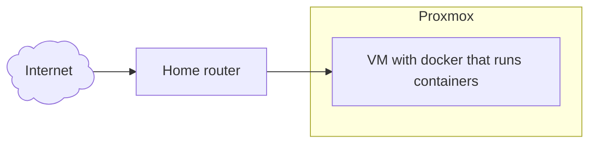
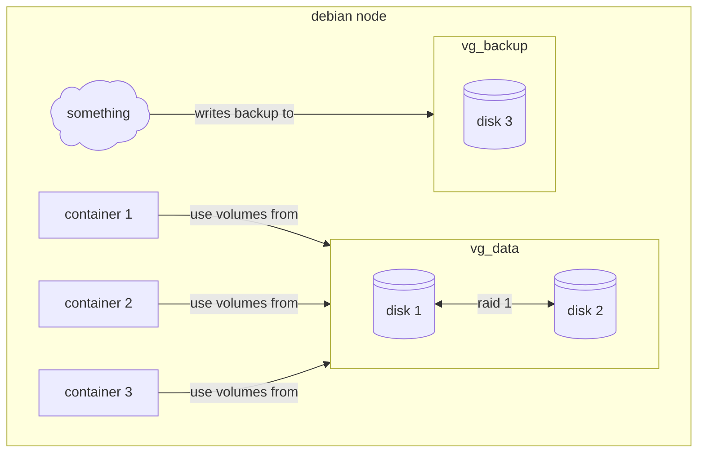

---
aliases:
  - /Escaping-From-proxmox
  - /1785504973
  - /posts/1785504973
  - /posts/Escaping-From-proxmox
book: posts
book_order:
date: 2026-07-31
description: migrating from proxmox ve to bare metal docker node
draft: false
images:
  - /1786485886.jpg
  - /1785687759.jpg
  - /1785688223.jpg
last_modified: "2026-08-13"
locale: en-US
references: []
show_image: false
show_right_column: true
show_title: true
show_toc: true
slug: 1785504973.md
tags: []
title: Escaping From proxmox
---

This seems a little bit weird to write but recently i decided to migrate my personal homelab solution from [proxmox ve](//1762772374.md)  to a bare metal debian installation running docker containers, **WHY?** well, first because i can, why am i even running a homelab in the first place? It's my personal playground after all so why i shouldn't play with it. Second cause managing a pve instance has become an overhead that i don't want to tollerate further, for various reasons:

Proxmox does a lot of things but none of that is something that i can or will make use to, for example it can run containers but it doesn't integrate well with docker ones, it manages notification but only with emails, it allows for custom hook scripts but for a limited set of events and to run efficient backups you have to rely on [proxmox backup server](https://www.proxmox.com/en/products/proxmox-backup-server/overview).

So after a lot of questioning i decided to simplify my homelab setup and remove Proxmox in favor of a plain debian installation managed trough [ansible](1762772358.md).

## Current setup

My current setup is composed of a single node Proxmox installation with a vm that acts as a docker host and runs my personal services.


> This sound already a little bit off, **why manage an all virtualization platform to run a single vm?**

This setup is good and dandy but lately as started to give me some major problems that i can't figure out

### The broken dirty bitmap

The setup runs backups of this big vm every night inside a pbs storage mounted over pve and an ansible playbook that triggers proxmox backup api. The vm disk exposes a dirty bitmap that allow for fast backups of the single things that has changed, this is crucial since it avoids coping all the data of the vms and speeds up significantly the procedure.

Lately i noticed that the backup job has failed, checking logs i found out that pbs refuses to use the dirty bitmap for some reason and tries to copy over all the content of the disk, causing the complete blackout of the vm for ours, pissed off i decided to stop the backup job. 😠

### Reboot problems

After a reboot cause by a power outage my CMOS battery has blown, so BIOS configurations are not maintained across reboots, this means that when i boot up the node virtualization is disabled in the bios and i get this funny message

```text
Generating cloud-init ISO
KVM virtualisation configured, but not available. Either disable in VM configuration or enable in BIOS.
```

So the vm doesn't boot up and i can access my services 😡

After all of this i decided to screw everything up and rebuild the entire cluster from the ground (why am i doing this to myself :melting_face:)

## Final Architecture

So i started to think about some architecture design ideas for the new cluster and i came with this setup



After speaking with one of my colleagues i started to reason about a raid solution for disks, i have no experience running raid systems and to me this seems like a good opportunity to learn about it, so i decided to use 2 disks in a raid 1 configuration for the main data and a single disk for backups, this way if a disk fails i can still run the setup while searching for a replacement disk

## Logical Volumes... docker volumes... same SHIT! :sunglasses:

My first idea was to mount lvm volumes inside the host filesystem and then mount the same path inside the container using the local volume driver but then i thought to myself

> Why not use lvm logical volumes as docker volumes !!!

So i start to look around and i found this  [docker plugin](https://github.com/containers/docker-lvm-plugin/tree/main) that does exactly what i need and i started experimenting with, then i realized that the last commit was 5 years ago and i decided to roll back to simple mounts over the filesystem

## First simulate !!!!

I must admit that i am a little bit scared of managing disks directly in production without testing them first, so my first idea is to simulate this new architecture using a Vagrantfile.
I asked claude to implement a [vagrant file](https://github.com/carnivuth/labcraft/blob/main/Vagrantfile) with some simple configurations and then added a sh provisioner to install mdadm and simulate my actual setup using virtual disks.

## Migration plan

One of the main problems in doing this is preserving data while changing the storage configuration, my first idea was to copy all data from the vm disk to the backup disk, create the RAID array and then coping data over, all good and dandy until i realized that the backup disk is the one that should go in the raid array 😅


So i started copying data over to my home pc, quick boot of my ventoy usb pen with debian trixie and in less then 15 minutes proxmox was gone


> Goodbye proxmox, it was fun while it lasted.... 🥲

## disks Odissea

Services installed, raid up and running, data copied over to the new setup, it was time to a final test, **system reboot** this is when my beautiful castle started to fall apart 🥲

After the first reboot there was no raid disk and the server fails to boot, rebooted into emergency shell and deleted the `/etc/fstab` lines to avoid mounting the volumes, Then the `mdadm` raid was not configured to assemble on boot, after that the **uuids inside disks and raid uuid where different**, and in the end one of the 2 disks was configured with a **mbr partition table** and mdadm refuses to assemble the cluster scared to delete data on the drive 😡

After all of that the backup lv started to give **filesystem error**, this is where i started to had enough of this, so i ran a `fsck` scan and forgot about it.

## Final setup

The final setup follows the already  described disk configuration

```text
NAME                     MAJ:MIN RM   SIZE RO TYPE  MOUNTPOINTS
sda                        8:0    0   1.8T  0 disk
└─md127                    9:127  0   1.8T  0 raid1
  └─data--vg-mnt--data   254:6    0   1.1T  0 lvm   /mnt/data
sdb                        8:16   0 931.5G  0 disk
└─backup--vg-mnt--backup 254:5    0 931.5G  0 lvm   /mnt/backup
sdc                        8:32   0   1.8T  0 disk
└─md127                    9:127  0   1.8T  0 raid1
  └─data--vg-mnt--data   254:6    0   1.1T  0 lvm   /mnt/data
sr0                       11:0    1  1024M  0 rom
nvme0n1                  259:0    0 931.5G  0 disk
├─nvme0n1p1              259:1    0   976M  0 part  /boot
├─nvme0n1p2              259:2    0     1K  0 part
└─nvme0n1p5              259:3    0 930.6G  0 part
  ├─torterra--vg-root    254:0    0  54.7G  0 lvm   /
  ├─torterra--vg-var     254:1    0 175.1G  0 lvm   /var
  ├─torterra--vg-swap_1  254:2    0  31.9G  0 lvm   [SWAP]
  ├─torterra--vg-tmp     254:3    0   2.8G  0 lvm   /tmp
  └─torterra--vg-home    254:4    0    50G  0 lvm   /home
```

For the moment i setup a temporary backup solution, just a cronjob that checks if disk are mounted and copy the data between disks

```bash
0 2 * * * mountpoint /mnt/backup && rsync -Pavrz --delete /mnt/data/ /mnt/backup/ && curl -L -s 'healthcheks.io url'
```
> pretty simple but does the job for now

## Conclusions

> Why am i even doing al of this !!!!

This journey was a fucking pain in the ass, full of failures and scary moments where all seemed to fell apart but it  was also fun and it give me the opportunity to work with `mdadm` and learn is inner workings, also now i can use the server GPU to run some container workflows without needing to fight with proxmox and gpu passtrough, so in the end i must say fun but painful


> Me after this 🫠
