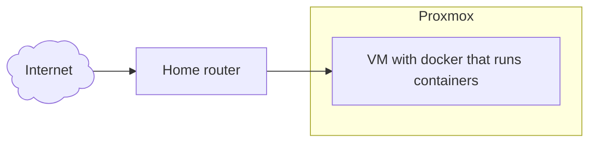
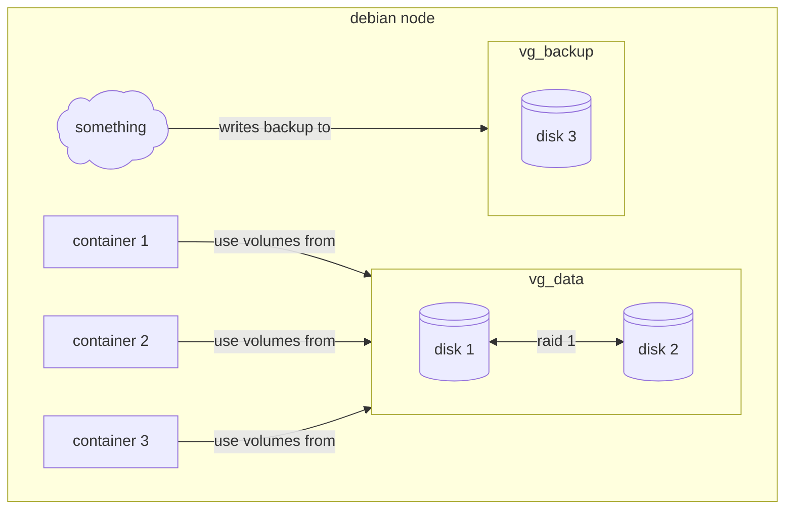

---
aliases:
  - /Escaping-From-proxmox
  - /1785504973
  - /posts/1785504973
  - /posts/Escaping-From-proxmox
book: posts
book_order:
date: 2026-07-31
description: migrating from proxmox ve to bare metal docker node
draft: true
images: []
last_modified: "2026-08-02"
locale: en-US
references: []
show_image: true
show_right_column: true
show_title: true
show_toc: true
slug: 1785504973.md
tags: []
title: Escaping From proxmox
---

This seems a little bit weird to write but recently i decided to migrate my personal homelab solution from [proxmox](//1762772374.md) ve to bare metal debian installation running docker containers, **WHY?** well, first because i can, it's my personal playground after all and second cause managing a pve instance has become an overhead that i don't want to tollerate further, for various reasons

## Current setup

My current setup is composed of a single node proxmox installation with a single vm that acts as a docker host that runs all of my personal services.



This sound already a little bit off, **why manage an all virtualization platform to run a single vm?**

## Backup management

Also backups starts to become an issue, in my pve setups backups are done with a pbs storage mounted on pve and an ansible playbook that creates a full backup of the vm filesystem, this is slow, backups a lot of data that i don't need, and it's complicated to restore a single modified file

## Reboot problems

After a reboot cause by a power outage my CMOS battery has blown, so BIOS configurations are not maintained across reboots, this means that when i boot up the node virtualization is disabled in the bios and i get this funny message 😡

```text
Generating cloud-init ISO
KVM virtualisation configured, but not available. Either disable in VM configuration or enable in BIOS.
```
> i know, i'm lazy and i should replace the CMOS battery 🙄

So, after all of this i decided to screw everything up and rebuild the entire cluster from the ground (why am i doing this to myself :melting_face:)

## Final Architecture

So i started to build some architecture ideas for the new cluster and i came with this setup



This architecture has some extra feature if compared to the old one

- Data are replicated thanks to the raid 1 configuration of the 2 hdds
- lvm allows for a per container backup and restore procedure

## Logical Volumes... docker volumes... same SHIT! :sunglasses:

My first idea was to mount lvm volumes inside the host filesystem and then mount the same path inside the container using the local volume driver but then i thought to myself

> Why not use lvm logical volumes as docker volumes !!!

So i start to look around and i found this  [docker plugin](https://github.com/containers/docker-lvm-plugin/tree/main) that does exactly what i need and i started experimenting with, then i realized that the last commit was 5 years ago and i decided to roll back to simple mounts over the filesystem

## First simulate !!!!

I must admit that i am a little bit scared of managing disks directly in production without testing them first, so my first idea is to simulate this new architecture using a Vagrantfile.
I asked claude to implement a [vagrant file](https://github.com/carnivuth/labcraft/blob/main/Vagrantfile) with some simple configurations and then added a sh provisioner to install mdadm and simulate my actual setup using virtual disks.

## Migration plan

One of the main problems in doing this is preserving data while changing the storage configuration, my first idea was to copy all data from the vm disk to the backup disk, create the RAID array and then coping data over, all good and dandy until i realized that the backup disk is the one that should go in the raid array 😅


So i started copying data over to my home pc, quick boot of my ventoy usb pen with debian trixie and in less then 15 minutes proxmox was gone


> Goodbye proxmox, it was fun while it lasted.... 🥲

## The `nextcloud` database adventure

After configuring the raid disk it was time to copy data over and deploy the containers inside my fresh debian node using my [gitops repo](https://github.com/carnivuth/labcraft), the docker definitions remains pretty much unchanged except from the nextcloud database configuration that i moved from a docker volume to a bind mount. In the backup procedure i was lazy and i didn't take a proper backup of the database, instead i have created a copy of the mount files.

## disks Odissea

Services installed, raid up and running, it was time to a final test, system reboot this is when my beautiful card castle started to fall apart 🥲

After the first reboot there was no raid disk and the server fails to boot, rebooted into emergency shell and deleted the `/etc/fstab` lines to avoid mounting the volumes, Then the mdadm raid was not configured to assemble on boot, after that the **uuids inside disks and raid uuid where different**, and in the end one of the 2 disks was configured with a **mbr partition table** and mdadm refuses to assemble the cluster scared to delete data on the drive 😡

After all of that the backup lv started to give **filesystem error**, this is where i started to had enough of this, so i ran a `fsck` scan and forgot about this

## Conclusions

> Why am i even doing al of this !!!!

This journey was a fucking pain in the ass, full of failures and scary moments where all seemed to fell apart but it  was also fun and it give me the opportunity to work with `mdadm` and learn is inner workings, also now i can use the server gpu to run some container workflows without needing to fight with proxmox and gpu passtrough, so in the end i must say fun but painful


> Me after this 🫠
