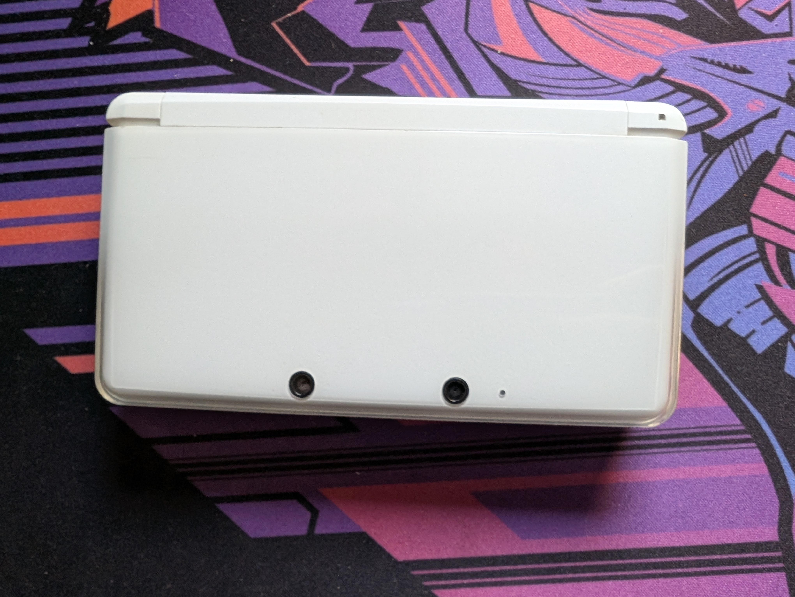

>My personal ultimate guide to setup a bullet proof nintendo 3ds emulator machine to take around and don't lose data

## The problem

In my daily routine there are often dead moments, like when i travel to work/university with public transport or when i simply need to take a break from the terminal, i was looking for an idea to fill up this moments, and one day, staring at my shelves the idea jumps to mind:

> my 3DS of course! I can just revive it and fill the SD card with roms !!!



But as always, i have to to over engineer thinks and make it extremely hard for myself (*of course*)

## Working on the patient

So as a first step i modded it to use some custom software following [this guide](https://3ds.hacks.guide/), this way i can run things from sd card an manage data in a more human way using my pc

After modding the 3ds one of my principal concern was to get something to quickly search for custom software and updates, and i stumbled across [the universal updater](https://universal-team.net/projects/universal-updater) which is a utility that does exactly what i wanted, it manages applications installations and updates :)

Then i proceed to install a bunch of software:

- `twilight menu` for running DS and GBA games
- `ftpd` for make bakups

Here is where i need to add juice to the mix by installing some roms that i have laying around (*quick reminder for commands*)

```bash
# mount SD card into filesystem
udiskctl mount /dev/sda1
# sync roms
rsync -r ~/Games/roms/* /run/media/$USER/3DS/roms
```

## What if sd card breaks?

The SD card is **not a reliable memory support**, it will fail taking with it all the precious save data (*it's already happened to me and i have learned my lesson, DO BACKUPS*), but i also know that if i manage the backup procedure manually by extracting the sd card periodically and copy save files, restore wouldn't be possible and i will forget or simply refuse to do it cause i'm lazy a.f. basically

So what to do? scripting things of course! the idea is to setup some system to search for my 3DS on the network, connect to it using ftp and copy savefiles

```mermaid
sequenceDiagram
participant 3ds
participant server
3ds ->> 3ds: enter home network
server ->> 3ds: connects and copy savefiles using ftp
```

Here the steps to reproduce a similar architecture:

- set static IP in the 3ds configuration (`or DHCP reservation on router`), this is done in order to avoid relying on some sort of discovery system (*that i didn't want to implement*) and simplify things in the script by setting a static IP address

Next i have created a new lxc container in my proxmox instance at home and configured to run the following job (*every linux box in your local network that can run bash and cron will do the job*):

> `/usr/local/bin/backup_3ds.sh`
```bash
#!/bin/bash
# server parameters
PORT=""
ADDRESS=""

# directories
NDS_DEST=/mnt/datastore/nds_saves; if [[ ! -d "$NDS_DEST" ]]; then mkdir -p "$NDS_DEST"; fi
GBA_DEST=/mnt/datastore/gba_saves; if [[ ! -d "$GBA_DEST" ]]; then mkdir -p "$GBA_DEST"; fi

if nc -z -w1 "$ADDRESS" "$PORT"; then
  echo "server is up, connecting for backup"
  ftp -n -p "$ADDRESS" "$PORT" <<EOF
        binary
        prompt
        lcd "$NDS_DEST"
        cd roms/nds/saves
        mget *
        lcd "$GBA_DEST"
        cd roms/gba/saves
        mget *
EOF
echo DONE
else
  echo "3ds is not listening for ftp connections"
fi
```

then i added the script to run as a cronjob

```bash
* * * * * /usr/local/bin/backup_3ds.sh >> /var/log/backup_3ds.sh 2>&1
```

I have also updated my [homelab project](https://github.com/carnivuth/labcraft/blob/main/playbooks/backupper.yml) to perform this steps in an ansible playbook in order to recreate this infrastructure automatically in case i need it and lose memory of this procedure.

After some weeks of usage i must say that i have underestimated what this machine can do, it's perfectly usable to this day and can run some big titles that does not rely on  connection, online accounts or infinitely long loading screens, just press the power switch and play exactly what i was looking for to cover those dead moments, one of the things that makes me love this idea is that i managed to do all of this by reusing some old tech that i already owned instead of buying something new from a big store saving my wallet and the planet in the process :)
