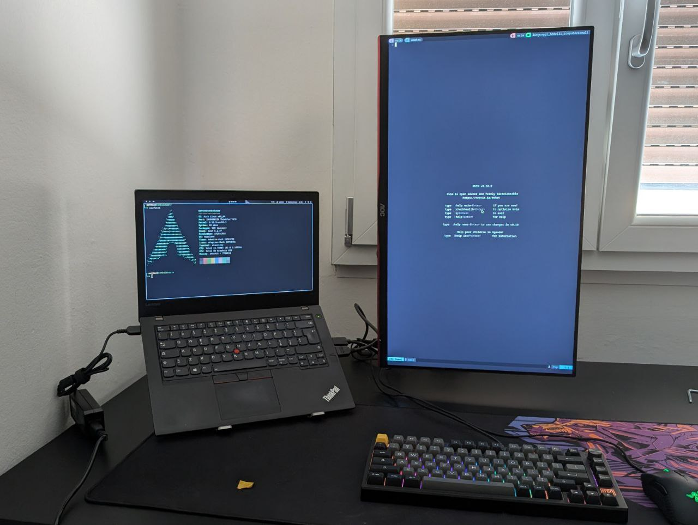
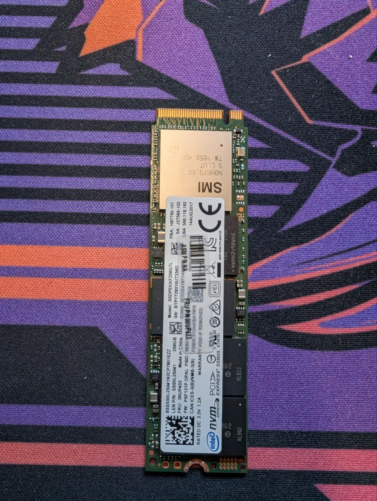



For my personal note taking process and projects i use a dell laptop that as served me pretty well in the current year, it has a pretty good build quality and specs but i'm scared to take it with me when i travel (*i'm a off-campus student/worker*) so i was looking for something sturdy that can handle falls and punches with no problem.

I recently get an old thinkpad T470 from work, is a good laptop with pretty decent specs (*8GB ram, 256GB SSD, 4 cores 4 threads CPU*) that makes it the perfect candidate for the job. So i decided to turn it into my travel/backup PC

> the new backup PC at work

## Hardware adjustments

The laptop was dirty so the first step was cleaning off al the dust and plastics with isopropile alcohol, in the process i decided to swap out the disk with an SSD that i have laying around for a slightly improvement in performance (*the old SSD appears to be slow as fuck for some reason*)

> the old SSD

After turning on the machine (*and  installing my [personal arch dotfiles](https://github.com/carnivuth/scripts)*) i realized that one of the two batteries was dead (**yes this think has two batteries, i was surprised too**) so i decided to replace the internal one and keep the external that is still usable, after all is a backup PC

## Software configurations 🪛

After installing and configuring my [dotfiles repo](https://github.com/carnivuth/scripts) i was facing an issue with the battery usage, when the battery dropped below \\(75% \\) the cpu frequency dropped down to \\(400MHz\\), after some research i found that it was a problem with CPU signals and registries, the fix was to download this [repo](https://github.com/yyearth/turnoff-BD-PROCHOT) and runs the scripts inside to reset the cpu registry (*if i understand the script correctly, it sets some value in some registry disabling some power saving mode in the CPU*), in order to run the script at startup i wrote a [bunch of files](https://github.com/carnivuth/fix_thinkpad_battery) to create an arch package that installs the script and a Systemd target to run at startup

## What i have learned

i have used this thinkpad for about a week in my personal workflows (software editing with vim and neovim, obsidian note taking) and i must say that this old piece of tech has still a lot to say, i also try to stress it by writing a [bash script](https://github.com/carnivuth/labcraft/blob/main/scripts/test_all.sh#L5) to run multiple molecule tests in parallel (which means spawning a bunch of virtualbox vm's and docker containers) and it wasn't panicking at all.
