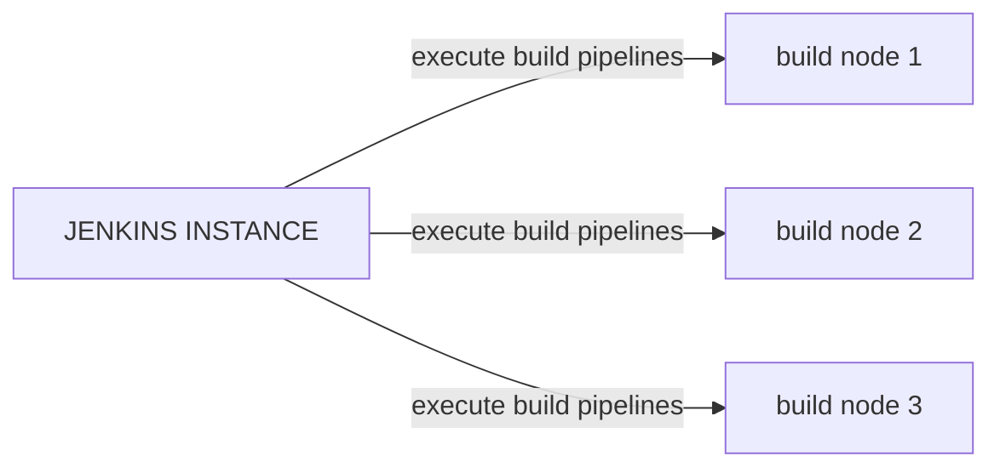
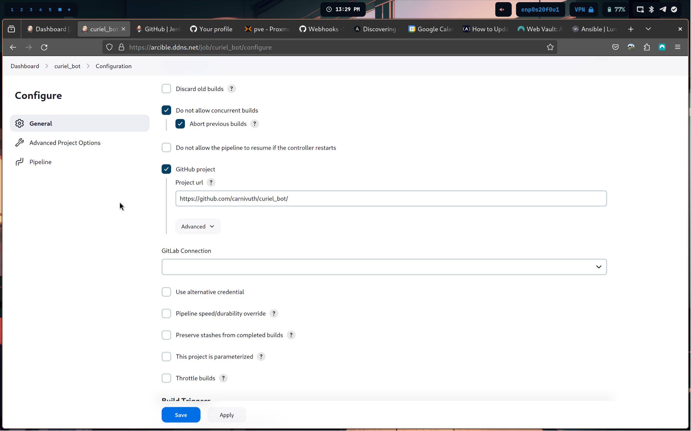
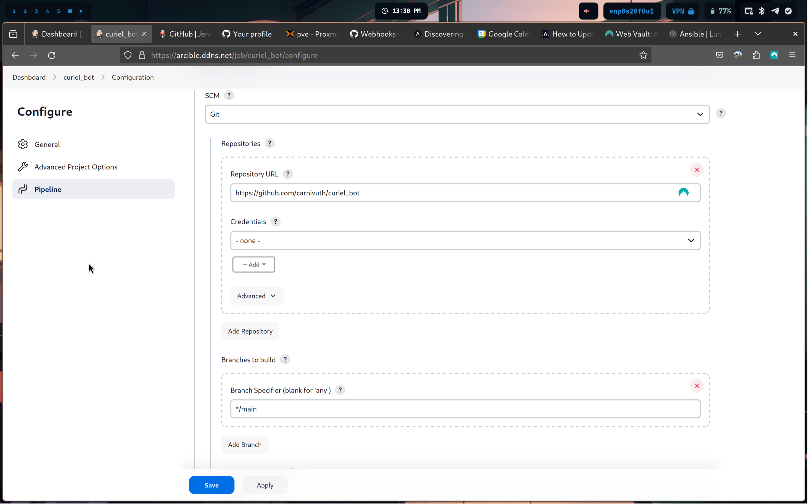

Jenkins is a CI service that can build and test software from different VCS, run automation tasks, integrate with ansible and much more, it's based around the concept of **builds**, builds are composed of a sequence of actions that  are executed on **build nodes**, build notes are enivronments that run the software build workflow




## Create a Jenkins CI pipeline for github repository

One way to use Jenkins is to run build processes for github hosted software as a substitute of github actions, in this setup github will trigger with a webhook the Jenkins instance in order to run a build defined in a Jenkinsfile inside the repo, events that triggers the CI pipeline can be specified in the github repo config section

- Create a new pipeline on Jenkins and add a GitHub repository url



- Set the CI script to pull from SCM



- Create a `Jenkinsfile` with the Jenkins CI pipeline (here example for building docker images)

```groovy
pipeline {
	environment {
		registry = "carnivuth/<project_name>"
		registryCredential = 'dockerhub_id'
		dockerImage = ''
	}

	agent any
	stages {
		stage('Cloning Repository') {
			steps {
				git branch:'main',
				    url:'https://github.com/carnivuth/<project_name>'
			}
		}

		stage('Building <project_name> docker image') {
			steps {
				script {
					dockerImage = docker.build registry + ":$BUILD_NUMBER"
				}
			}
		}

		stage('Upload docker image to docker hub') {
			steps {
				script {
					docker.withRegistry('', registryCredential) {
						dockerImage.push()
					}
				}
			}
		}

		stage('Cleaning up environment') {
			steps {
				sh "docker rmi $registry:$BUILD_NUMBER"
			}
		}
	}
}
```

- Configure Jenkins to add GitHub hooks automatically to the repository
