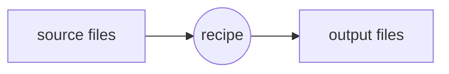

Make is a powerful build system with the simple concept of transforming files in other files based on a recipe



## special chars

- `%`
- `@`
- `<`
- `^`

## PHONY targets

```make
.PHONY: build clean
```

## Make files for specific types of files

```make
BUILDDIR = ./build

%.png: %.mmd
	mkdir -p $(BUILDDIR)
	mmdc -i $< -o $(BUILDDIR)/$@

clean:
	rm -rf $(BUILDDIR)

build: $(patsubst %.mmd,%.png,$(wildcard *.mmd))
```

[<](pages/technologies/kubernetes.md)[>](pages/technologies/man.md)
