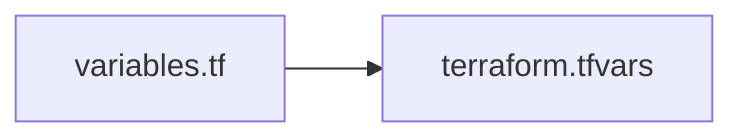

Terraform is a tool for IaC (*infrastructure as code*) that can work with multiple cloud platforms and virtualizers here i will wrote down some snippets and best practices

## Using variables and secrets

Terraform can build hosts based on var files and secrets stored outside of the versioning system



> sample of a `variables.tf` file
```terraform
variable "dev_ct_template" {
  default     = "local:vztmpl/archlinux-base_20230608-1_amd64.tar.zst"
  description = "template for development containers"
}
```

Vars can then be referred with the `var` keyword

```terraform
template = var.dev_ct_template
```

## Defining hosts with loops

Loops can be defined  specifying the variable `count` inside a specific resource, then the index of the loop  can be accessed via the `count.index` variable

```terraform
resource "proxmox_lxc" "ct-test" {
	// sets the  count variable to limit iterations
	count = 14
	// use the index to differentiate the hostname of the container
	hostname        = "ct-test-${count.index}"

	// ....

	rootfs {
		storage = var.main_pool
		size    = "8G"
	}

	network {
		name   = "eth0"
		bridge = "vmbr0"
		// use the index to differentiate the ip address
		ip     = "192.168.1.20${count.index}/24"
		gw     = var.guest_gw
	}
}
```

this will produce the following output on the proxmox host


[<](pages/technologies/proxmox.md)[>](pages/technologies/navidrome.md)
