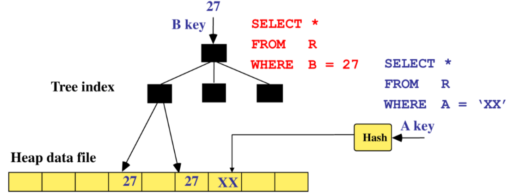


[L'organizzazione dei file](/tecnologie_basi_dati/gestione_disco#organizzazione-dei-file) da sola non e sufficiente, in molti casi sia [Heap file](/tecnologie_basi_dati/gestione_disco#heap-file) che [Sequential file](/tecnologie_basi_dati//gestione_disco#sequential-file) hanno i loro limiti, per esempio la ricerca nel primo caso e costosa e nel secondo e efficiente solo se effettuata sul campo di ordinamento del file

Per questo si introducono gli **indici**, strutture dati ausiliarie per facilitare l'accesso ai dati in fase di ricerca per uno specifico termine di ricerca

>[!TIP] il vantaggio sta nel fatto che l'indice e più piccolo -> ricerca più veloce

Da un punto di vista logico un indice e una collezione di coppie \\((k_i,p_i)\\) dove:
- \\(k\\) e il valore di un attributo su cui l'indice e costruito
- \\(p\\) e un RID (*massimo un PID*)  della tupla con il dato valore

esistono 2 tipologie principali di indici:

- **Indici ordinati** Le coppie sono ordinate per l'attributo chiave
- **Indici hash**: Viene utilizzata una funzione di hash per trovare la posizione di una data entry dato il valore della chiave
>[!WARNING] non il massimo per le ricerche a range

Ci sono inoltre diverse nomenclature applicate agli indici

- **clustered/unclustered** un indice si dice clustered se e costruito sull'attributo con cui e ordinato il data file
- **primary/secondary** se costruito su un attributo `unique` (tutto ciò che può essere chiave primaria)
- **dense/sparse** il numero di coppie nell'indice e uguale al numero di entry nel data file
- **single level/multi level** un indice multi livello e composto da indici sparsi che indicizzano altri indici (*possibili \\(n\\) livelli*)

## E nel disco? come rappresentare gli indici

Gli indici esattamente come il data file sono strutture dati che vanno caricate dal disco in memoria centrale, e necessario di conseguenza rappresentarle in maniera efficiente per non perdere i vantaggi di ricerca del indice.
