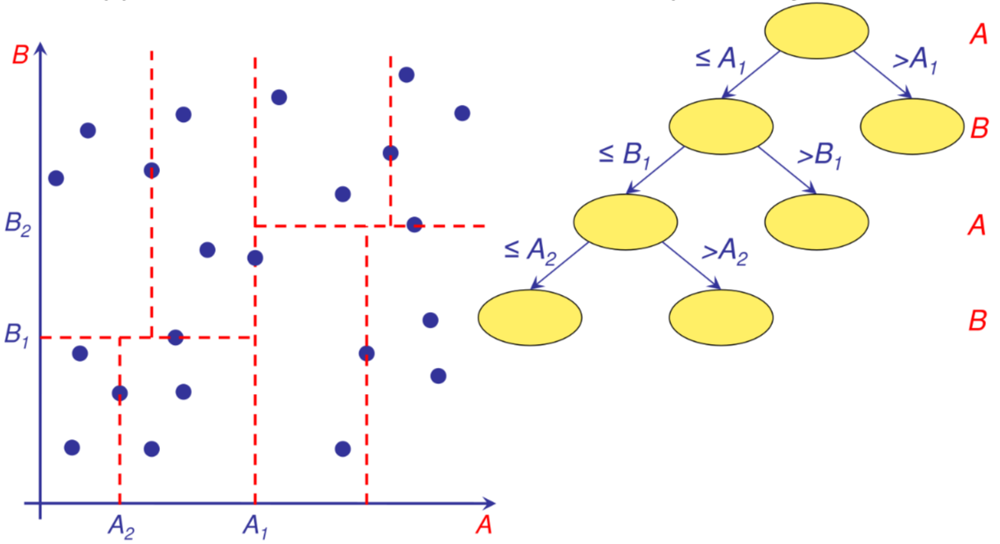
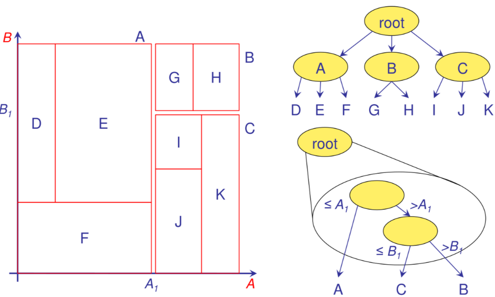
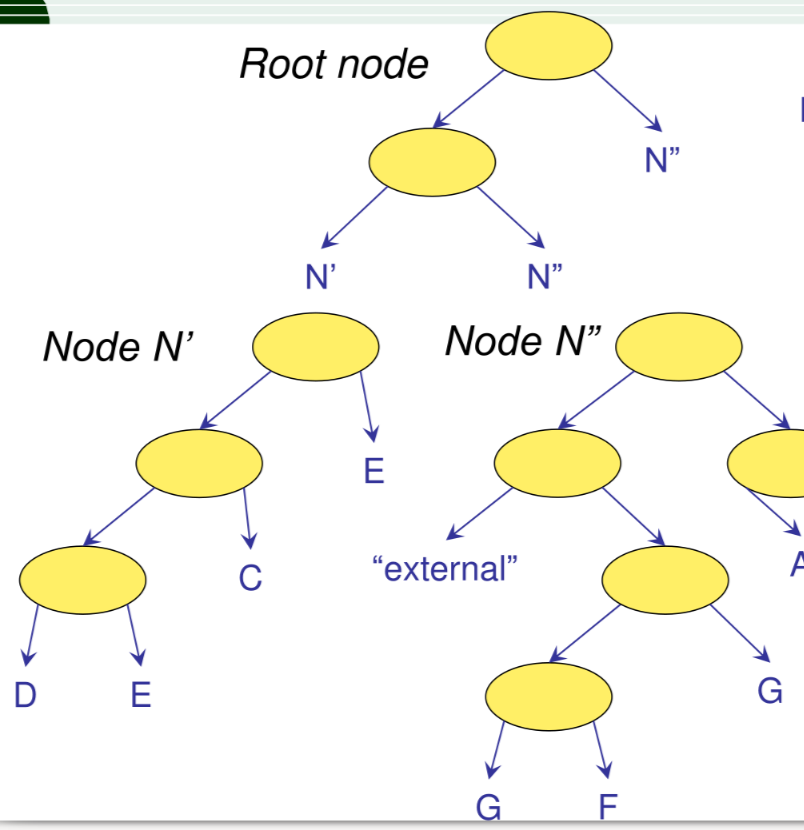
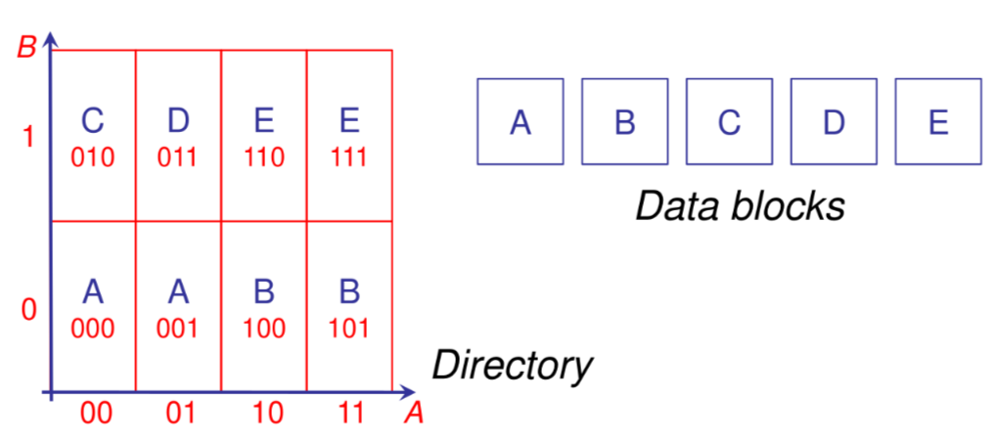
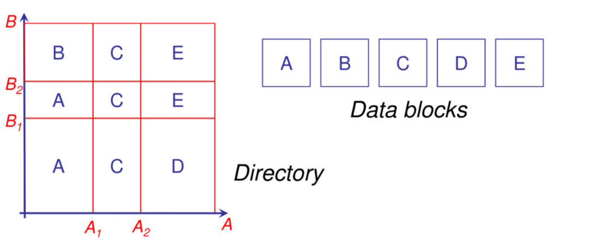
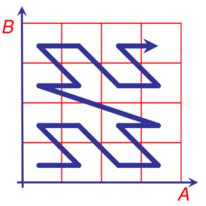


Nati per soddisfare query che coinvolgono molteplici attributi, tra cui

- query puntuali $A_1 = v_1, A_2 = v_2, … , A_n = v_n$
- query finestra $l_1 \leq A_1 \leq h_0, l_2 \leq A_2 \leq h_2, … , l_n \leq A_n \leq h_n$
- nearest neighbor query $A_1 \approx v_1, A_2 \approx v_2, … , A_n \approx v_n$

## Limiti del [b+tree](/tecnologie_basi_dati/b+tree)

Supponendo di avere una window query su due attributi $A,B$ del tipo

```sql
SELECT * FROM table as T
WHERE T.A > 10
AND T.A < 20
AND T.B > 10
AND T.B < 20
```

In questo caso e possibile utilizzare un indice [b+tree](/tecnologie_basi_dati/b+tree) su entrambi gli attributi oppure 2 indici monodimensionali su i due attributi

>[!ERROR] In entrambi i casi si compie del lavoro inutile perché i punti spazialmente vicini non sono posti nelle stesse foglie

## Indicizzamento spaziale

Per affrontare il problema sono state proposte una marea di strutture dati ma il concetto resta lo stesso, **mappare record spazialmente vicini nelle stesse pagine**

## K-d-tree

Struttura mantenuta in memoria centrale non paginata e non bilanciata, dove ogni nodo rappresenta uno split sul valore mediana dell'attributo con la maggiore varianza



### K-d-tree ricerca

In caso di ricerca si visitano tutti i rami dell'albero che contengono regioni che si intersecano con la regione definita dalla query

>[!WARNING] dato che l'albero non e bilanciato sono necessarie operazioni di ribilanciamento periodiche

>[!ERROR] le eliminazioni sono estremamente complicate

## Paginando il k-d-tree: k-d-b-tree

E la versione paginata del [K-d-tree](#k-d-tree) dove ogni nodo corrisponde a un iper-rettangolo dello spazio ottenuto come unione delle regioni figlie



### K-d-b-tree: overflow

In caso di overflow si partizionano i nodi padri fino a risalire alla root

>[!WARNING] non e sempre possibile mantenere il bilanciamento durante l'operazione di split

## hB-tree

Variante del [k-d-B-tree](#paginando-il-k-d-tree-k-d-b-tree) in cui le regioni possono contenere *buchi*, questo migliora la situazione in caso di split di un data block la differenza e data dal fatto che un nodo può essere referenziato da più separazioni


### hB-tree: split

In caso di split della root i nodi figli vengono splittati come segue



## Excell

Tecnica basata su una hash directory fatta a griglia $n$-dimensionale dove ogni cella corrisponde a una datapage **ma non e vero il contrario**, estendendo il concetto di [extendible hashing](/tecnologie_basi_dati/indici_hash#extendible-hashing) al caso multidimensionale.



### Excell: split


In caso di split ci sono due casistiche:

- split di una datapage referenziata da due celle della directory, in questo caso e sufficiente aggiornare le referenze della directory
- split di una datapage referenziata da una cella della directory in questo caso si raddoppia la dimensione della griglia

>[!NOTE] tutte le problematiche e considerazioni fatte per l'[extendible hashing](/tecnologie_basi_dati/indici_hash#extendible-hashing) restano valide


## Grid file

Versione generalizzata del [Excell](#excell), dove gli intervalli hanno dimensione variabile,



## Mono-dimensional sorting

Si basa sul concetto di linearizzare lo spazio n dimensionale per mezzo delle cosiddette space-filling curves



>[!ERROR] In questo caso preservare l'ordine locale risulta quasi impossibile
